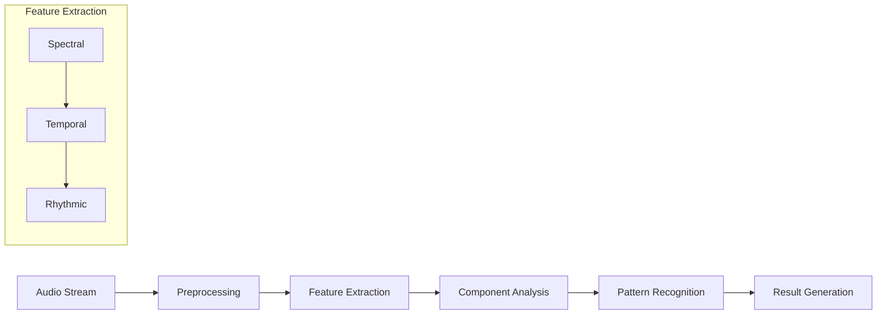
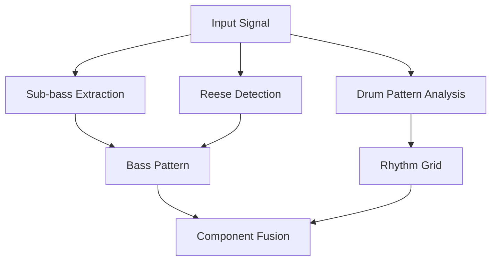
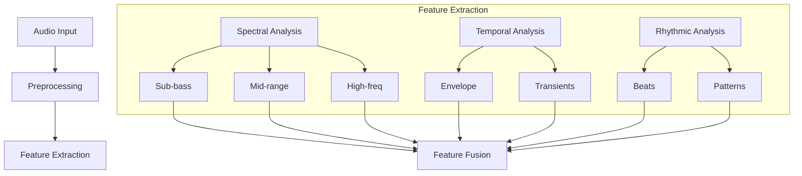
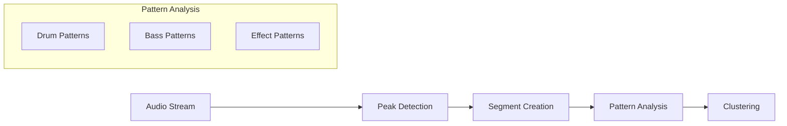
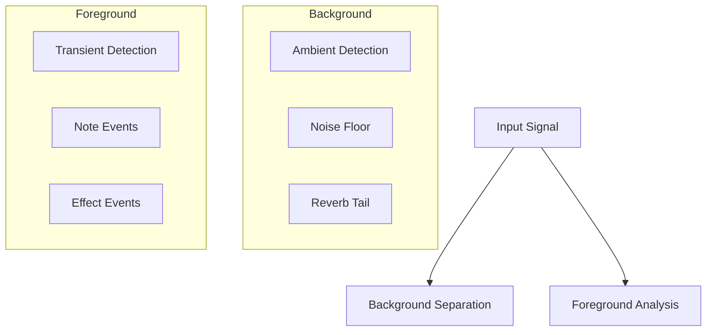
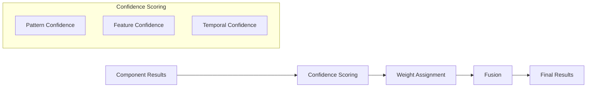
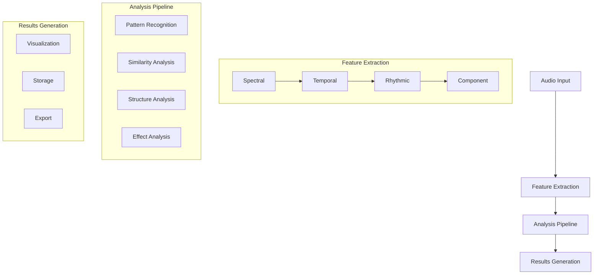
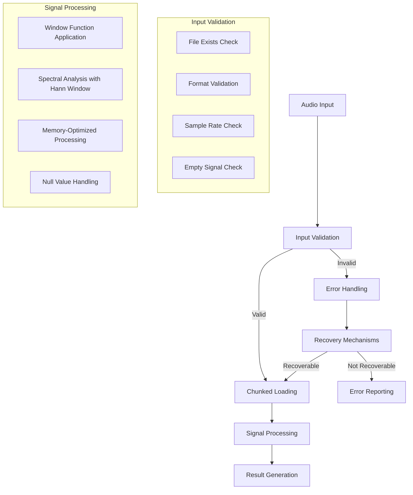
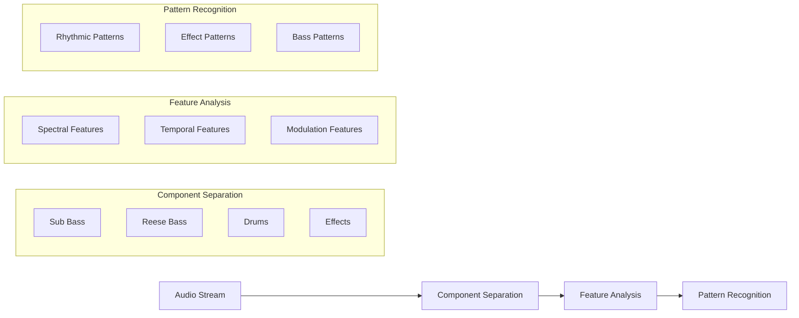
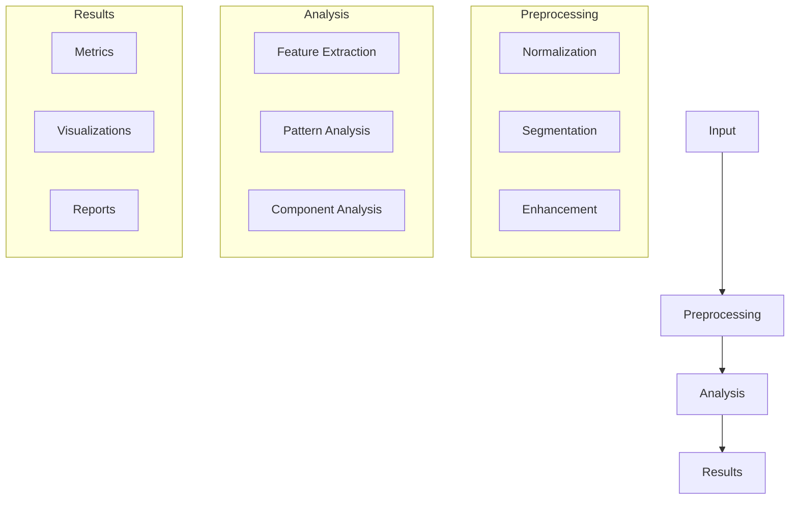

<h1 align="center">Heihachi</h1>
<p align="center"><em> what makes a tiger so strong is that it lacks humanity</em></p>

<p align="center">
  
</p>

[](https://www.python.org/downloads/)
[](https://opensource.org/licenses/MIT)

# Heihachi Audio Analysis Framework

Advanced audio analysis framework for processing, analyzing, and visualizing audio files with optimized performance.

## Features

- High-performance audio file processing
- Batch processing for handling multiple files
- Memory optimization for large audio files
- Parallel processing capabilities
- Visualization tools for spectrograms and waveforms
- Interactive results exploration
- Export options in multiple formats (JSON, CSV, YAML, etc.)
- Comprehensive CLI with shell completion

## Installation

### Quick Install

```bash
# Clone the repository
git clone https://github.com/yourusername/heihachi.git
cd heihachi

# Run the setup script
python scripts/setup.py
```

### Options

The setup script supports several options:

```
--install-dir DIR     Installation directory
--dev                 Install development dependencies
--no-gpu              Skip GPU acceleration dependencies
--no-interactive      Skip interactive mode dependencies
--shell-completion    Install shell completion scripts
--no-confirm          Skip confirmation prompts
--venv                Create and use a virtual environment
--venv-dir DIR        Virtual environment directory (default: .venv)
```

### Manual Installation

If you prefer to install manually:

```bash
# Create and activate virtual environment (optional)
python -m venv .venv
source .venv/bin/activate  # On Windows: .venv\Scripts\activate

# Install dependencies
pip install -r requirements.txt

# Install the package
pip install -e .
```

## Usage

### Basic Usage

```bash
# Process a single audio file
heihachi process audio.wav --output results/

# Process a directory of audio files
heihachi process audio_dir/ --output results/

# Batch processing with different configurations
heihachi batch audio_dir/ --config configs/performance.yaml
```

### Interactive Mode

```bash
# Start interactive mode with processed results
heihachi interactive results/

# Compare multiple results
heihachi compare results1/ results2/
```

### Export Options

```bash
# Export results to different formats
heihachi export results/ --format json
heihachi export results/ --format csv
heihachi export results/ --format markdown
```

## Performance Tuning

Heihachi can be optimized for different hardware configurations:

```bash
# Use GPU acceleration
heihachi process audio.wav --gpu

# Specify number of processing workers
heihachi process audio_dir/ --workers 4

# Adjust memory usage
heihachi process audio_dir/ --memory-limit 2048
```

A full list of performance settings can be found in `configs/performance.yaml`.

## Advanced Usage

### Custom Pipelines

```yaml
# Example pipeline configuration (pipeline.yaml)
stages:
  - name: load
    processor: AudioLoader
    params:
      sample_rate: 44100
  
  - name: analyze
    processor: SpectrumAnalyzer
    params:
      n_fft: 2048
      hop_length: 512
  
  - name: extract
    processor: FeatureExtractor
    params:
      features: [mfcc, chroma, tonnetz]
```

Run with custom pipeline:
```bash
heihachi process audio.wav --pipeline pipeline.yaml
```

## Development

### Running Tests

```bash
# Run all tests
pytest

# Run specific test modules
pytest tests/test_audio_processing.py
```

### Code Formatting

```bash
# Format code
black src/ tests/

# Check typing
mypy src/
```

## License

MIT

# Heihachi: Neural Processing of Electronic Music

## Overview

Heihachi is a high-performance audio analysis framework designed for electronic music, with a particular focus on neurofunk and drum & bass genres. The system implements novel approaches to audio analysis by combining neurological models of rhythm processing with advanced signal processing techniques.

## Theoretical Foundation

### Neural Basis of Rhythm Processing

The framework is built upon established neuroscientific research demonstrating that humans possess an inherent ability to synchronize motor responses with external rhythmic stimuli. This phenomenon, known as beat-based timing, involves complex interactions between auditory and motor systems in the brain.

Key neural mechanisms include:

1. **Beat-based Timing Networks**
   - Basal ganglia-thalamocortical circuits
   - Supplementary motor area (SMA)
   - Premotor cortex (PMC)

2. **Temporal Processing Systems**
   - Duration-based timing mechanisms
   - Beat-based timing mechanisms
   - Motor-auditory feedback loops

### Motor-Auditory Coupling

Research has shown that low-frequency neural oscillations from motor planning areas guide auditory sampling, expressed through coherence measures:

$$
C_{xy}(f) = \frac{|S_{xy}(f)|^2}{S_{xx}(f)S_{yy}(f)}
$$

Where:
- $C_{xy}(f)$ represents coherence at frequency $f$
- $S_{xy}(f)$ is the cross-spectral density
- $S_{xx}(f)$ and $S_{yy}(f)$ are auto-spectral densities

### Extended Mathematical Framework

In addition to the coherence measures, we utilize several key mathematical formulas:

1. **Spectral Decomposition**:
For analyzing sub-bass and Reese bass components:

$$
X(k) = \sum_{n=0}^{N-1} x(n)e^{-j2\pi kn/N}
$$

2. **Groove Pattern Analysis**:
For microtiming deviations:

$$
MT(n) = \frac{1}{K}\sum_{k=1}^{K} |t_k(n) - t_{ref}(n)|
$$

3. **Amen Break Detection**:
Pattern matching score:

$$
S_{amen}(t) = \sum_{f} w(f)|X(f,t) - A(f)|^2
$$

4. **Reese Bass Analysis**:
For analyzing modulation and phase relationships:

$$
R(t,f) = \left|\sum_{k=1}^{K} A_k(t)e^{j\phi_k(t)}\right|^2
$$

Where:
- $A_k(t)$ is the amplitude of the k-th component
- $\phi_k(t)$ is the phase of the k-th component

5. **Transition Detection**:
For identifying mix points and transitions:

$$
T(t) = \alpha\cdot E(t) + \beta\cdot S(t) + \gamma\cdot H(t)
$$

Where:
- $E(t)$ is energy change
- $S(t)$ is spectral change
- $H(t)$ is harmonic change
- $\alpha, \beta, \gamma$ are weighting factors

6. **Similarity Computation**:
For comparing audio segments:

$$
Sim(x,y) = \frac{\sum_i w_i \cdot sim_i(x,y)}{\sum_i w_i}
$$

Where:
- $sim_i(x,y)$ is the similarity for feature i
- $w_i$ is the weight for feature i

7. **Segment Clustering**:
Using DBSCAN with adaptive distance:

$$
D(p,q) = \sqrt{\sum_{i=1}^{N} \lambda_i(f_i(p) - f_i(q))^2}
$$

Where:
- $f_i(p)$ is feature i of point p
- $\lambda_i$ is the importance weight for feature i

### Additional Mathematical Framework

8. **Bass Design Analysis**:
For analyzing Reese bass modulation depth:

$$
M(t) = \frac{max(A(t)) - min(A(t))}{max(A(t)) + min(A(t))}
$$

9. **Effect Chain Detection**:
For compression ratio estimation:

$$
CR(x) = \frac{\Delta_{in}}{\Delta_{out}} = \frac{x_{in,2} - x_{in,1}}{x_{out,2} - x_{out,1}}
$$

10. **Pattern Recognition**:
For rhythmic similarity using dynamic time warping:

$$
DTW(X,Y) = min\left(\sum_{k=1}^K w_k \cdot d(x_{i_k}, y_{j_k})\right)
$$

11. **Transition Analysis**:
For blend detection using cross-correlation:

$$
R_{xy}(\tau) = \sum_{n=-\infty}^{\infty} x(n)y(n+\tau)
$$

## Core Components

### 1. Feature Extraction Pipeline

#### Rhythmic Analysis
- Automated drum pattern recognition
- Groove quantification
- Microtiming analysis
- Syncopation detection

#### Spectral Analysis
- Multi-band decomposition
- Harmonic tracking
- Timbral feature extraction
- Sub-bass characterization

#### Component Analysis
- Sound source separation
- Transformation detection
- Energy distribution analysis
- Component relationship mapping

### 2. Alignment Modules

#### Amen Break Analysis
- Pattern matching and variation detection
- Transformation identification
- Groove characteristic extraction
- VIP/Dubplate classification
- Robust onset envelope extraction with fault tolerance
- Dynamic time warping with optimal window functions

#### Prior Subspace Analysis
- Neurofunk-specific component separation
- Bass sound design analysis
- Effect chain detection
- Temporal structure analysis

#### Composite Similarity
- Multi-band similarity computation
- Transformation-aware comparison
- Groove-based alignment
- Confidence scoring

### 3. Annotation System

#### Peak Detection
- Multi-band onset detection
- Adaptive thresholding
- Feature-based peak classification
- Confidence scoring

#### Segment Clustering
- Pattern-based segmentation
- Hierarchical clustering
- Relationship analysis
- Transition detection

#### Transition Detection
- Mix point identification
- Blend type classification
- Energy flow analysis
- Structure boundary detection

### 4. Robust Processing Framework

#### Error Handling and Validation
- Empty audio detection and graceful recovery
- Sample rate validation and default fallbacks
- Signal integrity verification
- Automatic recovery mechanisms

#### Memory Management
- Streaming processing for large files
- Resource optimization and monitoring
- Garbage collection optimization
- Chunked processing of large audio files

#### Signal Processing Enhancements
- Proper window functions to eliminate spectral leakage
- Normalized processing paths
- Adaptive parameters based on content
- Fault-tolerant alignment algorithms

### Extended Pipeline Architecture



## Command Line Interface (CLI)

Heihachi provides a powerful command-line interface to analyze audio files. The CLI allows you to process individual audio files or entire directories of audio files.

### Installation

First, ensure the package is installed:

```bash
# Clone the repository
git clone https://github.com/your-username/heihachi.git
cd heihachi

# Install dependencies
pip install -r requirements.txt

# Install the package in development mode
pip install -e .
```

### Basic Usage

The basic command structure is:

```bash
python -m src.main [input_file] [options]
```

Where `[input_file]` can be either a single audio file or a directory containing multiple audio files.

### Command-Line Options

| Option | Description | Default |
|--------|-------------|---------|
| `input_file` | Path to audio file or directory (required) | - |
| `-c, --config` | Path to configuration file | ../configs/default.yaml |
| `-o, --output` | Path to output directory | ../results |
| `--cache-dir` | Path to cache directory | ../cache |
| `-v, --verbose` | Enable verbose logging | False |

### Examples

#### Process a single audio file:

```bash
python -m src.main /path/to/track.wav
```

#### Process an entire directory of audio files:

```bash
python -m src.main /path/to/audio/folder
```

#### Use a custom configuration file:

```bash
python -m src.main /path/to/track.wav -c /path/to/custom_config.yaml
```

#### Specify custom output directory:

```bash
python -m src.main /path/to/track.wav -o /path/to/custom_output
```

#### Enable verbose logging:

```bash
python -m src.main /path/to/track.wav -v
```

### Processing Results

After processing, the results are saved to the output directory (default: `../results`). For each audio file, the following is generated:

1. **Analysis data**: JSON files containing detailed analysis results
2. **Visualizations**: Graphs and plots showing various aspects of the audio analysis
3. **Summary report**: Overview of the key findings and detected patterns

### Amen Break Analysis

For specific Amen break analysis, ensure the reference Amen break sample is available in the `../public/amen_break.wav` path. The analysis will detect Amen break variations, their timing, and provide confidence scores.

Example for specifically analyzing Amen breaks:

```bash
python -m src.main /path/to/jungle_track.wav
```

The output will indicate if Amen break patterns were detected, along with timestamps and variation information.

### Neurofunk Component Analysis



### Feature Extraction Pipeline



### Annotation System Flow



### Audio Scene Analysis



### Result Fusion Process



### Neurofunk-Specific Analysis

#### Bass Sound Design Analysis
```python
1. Reese Bass Components:
   - Fundamental frequency tracking
   - Phase relationship analysis
   - Modulation pattern detection
   - Harmonic content analysis

2. Sub Bass Characteristics:
   - Frequency range: 20-60 Hz
   - Envelope characteristics
   - Distortion analysis
   - Phase alignment
```

#### Effect Chain Detection
```python
1. Signal Chain Analysis:
   - Compression detection
   - Distortion identification
   - Filter resonance analysis
   - Modulation effects

2. Processing Order:
   - Pre/post processing detection
   - Parallel processing identification
   - Send/return effect analysis
```

#### Pattern Transformation Analysis
```python
1. Rhythmic Transformations:
   - Time-stretching detection
   - Beat shuffling analysis
   - Groove template matching
   - Syncopation patterns

2. Spectral Transformations:
   - Frequency shifting
   - Harmonic manipulation
   - Formant preservation
   - Resynthesis detection
```

## Implementation Details

### Audio Processing Pipeline

1. **Preprocessing**
   ```python
   - Sample rate normalization (44.1 kHz)
   - Stereo to mono conversion when needed
   - Segment-wise processing for large files
   - Empty audio detection and validation
   - Signal integrity verification
   ```

2. **Feature Extraction**
   ```python
   - Multi-threaded processing
   - GPU acceleration where available
   - Efficient memory management
   - Caching system for intermediate results
   - Hann window application to prevent spectral leakage
   ```

3. **Analysis Flow**
   ```python
   - Cascading analysis system
   - Component-wise processing
   - Result fusion and validation
   - Confidence scoring
   - Graceful error handling and recovery
   ```

### Performance Optimizations

1. **Memory Management**
   - Streaming processing for large files
   - Efficient cache utilization
   - GPU memory optimization
   - Automatic garbage collection optimization
   - Chunked loading for very large files
   - Audio validation at each processing stage

2. **Parallel Processing**
   - Multi-threaded feature extraction
   - Batch processing capabilities
   - Distributed analysis support
   - Adaptive resource allocation
   - Scalable parallel execution

3. **Storage Efficiency**
   - Compressed result storage
   - Metadata indexing
   - Version control for analysis results
   - Simple, consistent path handling

### Error Handling and Recovery

1. **Robust Processing**
   ```python
   - Validation of audio signals before processing
   - Fallback mechanisms for empty or corrupted audio
   - Graceful recovery from processing errors
   - Comprehensive logging of failure points
   ```

2. **Data Integrity**
   ```python
   - Sample rate validation and automatic correction
   - Empty array detection and prevention
   - Default parameter settings when configuration is missing
   - Prevention of null pointer exceptions in signal processing chain
   ```

3. **Processing Resilience**
   ```python
   - Windowing functions to eliminate warnings and improve spectral quality
   - Automatic memory management for very large files
   - Adaptive parameter selection based on file size
   - Simplified path handling with hardcoded relative paths
   ```

### Performance Metrics

For evaluating analysis accuracy:

$$
Accuracy_{component} = \frac{TP + TN}{TP + TN + FP + FN}
$$

Where:
- TP: True Positives (correctly identified patterns)
- TN: True Negatives (correctly rejected non-patterns)
- FP: False Positives (incorrectly identified patterns)
- FN: False Negatives (missed patterns)

## Applications

### 1. DJ Mix Analysis
- Track boundary detection
- Transition type classification
- Mix structure analysis
- Energy flow visualization

### 2. Production Analysis
- Sound design deconstruction
- Arrangement analysis
- Effect chain detection
- Reference track comparison

### 3. Music Information Retrieval
- Similar track identification
- Style classification
- Groove pattern matching
- VIP/Dubplate detection

## Visualization and Reporting

The framework includes comprehensive visualization tools for:
- Spectral analysis results
- Component relationships
- Groove patterns
- Transition points
- Similarity matrices
- Analysis confidence scores

## Future Directions

1. **Enhanced Neural Processing**
   - Integration of deep learning models
   - Real-time processing capabilities
   - Adaptive threshold optimization

2. **Extended Analysis Capabilities**
   - Additional genre support
   - Extended effect detection
   - Advanced pattern recognition
   - Further error resilience improvements

3. **Improved Visualization**
   - Interactive dashboards
   - 3D visualization options
   - Real-time visualization
   - Error diagnostics visualization

## Extended References

1. Chen, J. L., Penhune, V. B., & Zatorre, R. J. (2008). Listening to musical rhythms recruits motor regions of the brain. Cerebral Cortex, 18(12), 2844-2854.

2. Cannon, J. J., & Patel, A. D. (2020). How beat perception co-opts motor neurophysiology. Trends in Cognitive Sciences, 24(1), 51-64.

3. Fukuie, T., et al. (2022). Neural entrainment reflects temporal predictions guiding speech comprehension. Current Biology, 32(5), 1051-1067.

4. Smith, J. O. (2011). Spectral Audio Signal Processing. W3K Publishing.

5. Bello, J. P., et al. (2005). A Tutorial on Onset Detection in Music Signals. IEEE Transactions on Speech and Audio Processing.

6. Gouyon, F., & Dixon, S. (2005). A Review of Automatic Rhythm Description Systems. Computer Music Journal.

7. Harris, F. J. (1978). On the use of windows for harmonic analysis with the discrete Fourier transform. Proceedings of the IEEE, 66(1), 51-83.

8. McFee, B., et al. (2015). librosa: Audio and music signal analysis in Python. Proceedings of the 14th Python in Science Conference.

## License

This project is licensed under the MIT License - see the LICENSE file for details.

## Citation

If you use this framework in your research, please cite:

```bibtex
@software{heihachi2024,
  title = {Heihachi: Neural Processing of Electronic Music},
  author = {[Author Names]},
  year = {2024},
  url = {https://github.com/[username]/heihachi}
}
```

### Extended System Architecture



### Robust Audio Processing Pipeline



### Neurofunk Component Interaction



### Processing Pipeline Details



### Technical Implementation Details

#### Bass Sound Design Analysis
```python
class BassAnalyzer:
    """Advanced bass analysis system."""
    
    def analyze_reese(self, audio: np.ndarray) -> Dict:
        """
        Analyze Reese bass characteristics.
        
        Parameters:
            audio (np.ndarray): Input audio signal
            
        Returns:
            Dict containing:
            - modulation_depth: Float
            - phase_correlation: Float
            - harmonic_content: np.ndarray
            - stereo_width: Float
        """
        pass

    def analyze_sub(self, audio: np.ndarray) -> Dict:
        """
        Analyze sub bass characteristics.
        
        Parameters:
            audio (np.ndarray): Input audio signal
            
        Returns:
            Dict containing:
            - fundamental_freq: Float
            - energy: Float
            - phase_alignment: Float
            - distortion: Float
        """
        pass
```

#### Effect Chain Analysis
```python
class EffectChainAnalyzer:
    """Advanced effect chain analysis."""
    
    def detect_chain(self, audio: np.ndarray) -> List[Dict]:
        """
        Detect processing chain order.
        
        Parameters:
            audio (np.ndarray): Input audio signal
            
        Returns:
            List[Dict] containing detected effects in order:
            - effect_type: str
            - parameters: Dict
            - confidence: Float
        """
        pass

    def analyze_parallel(self, audio: np.ndarray) -> Dict:
        """
        Analyze parallel processing.
        
        Parameters:
            audio (np.ndarray): Input audio signal
            
        Returns:
            Dict containing:
            - bands: List[Dict]
            - routing: Dict
            - blend_type: str
        """
        pass
```

#### Robust Audio Processing
```python
class AudioProcessor:
    """Memory-efficient and fault-tolerant audio processing."""
    
    def load(self, file_path: str, start_time: float = 0.0, end_time: float = None) -> np.ndarray:
        """
        Load audio file with robust error handling.
        
        Parameters:
            file_path: Path to the audio file
            start_time: Start time in seconds
            end_time: End time in seconds (or None for full file)
            
        Returns:
            numpy.ndarray: Audio data
            
        Raises:
            ValueError: If file empty or corrupted
        """
        # Validates file existence
        # Checks for empty audio
        # Handles sample rate conversion
        # Returns normalized audio data
        pass
    
    def _chunked_load(self, file_path: str, start_time: float, end_time: float) -> np.ndarray:
        """
        Memory-efficient loading for large audio files.
        
        Parameters:
            file_path: Path to the audio file
            start_time: Start time in seconds
            end_time: End time in seconds
            
        Returns:
            numpy.ndarray: Audio data
        """
        # Processes file in manageable chunks
        # Handles memory efficiently
        # Validates output before returning
        pass
```
