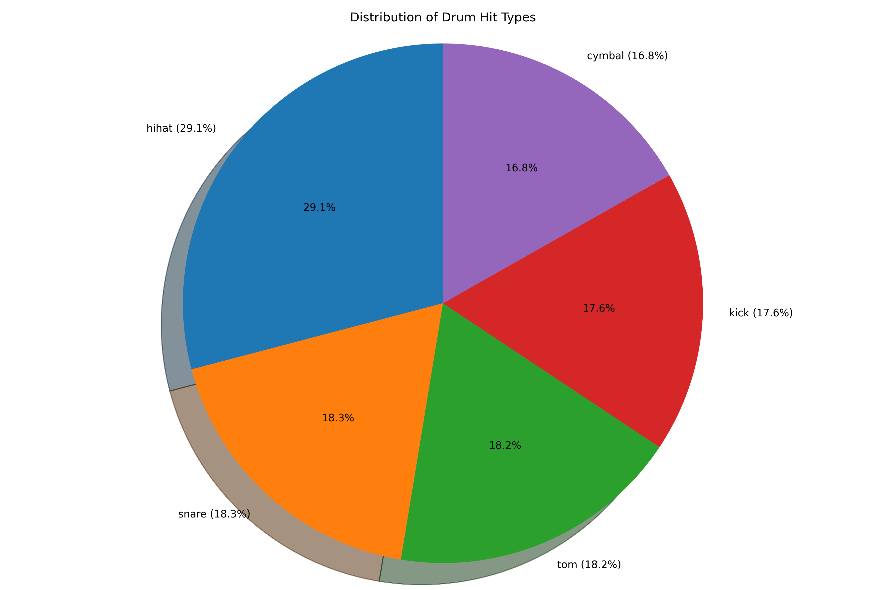
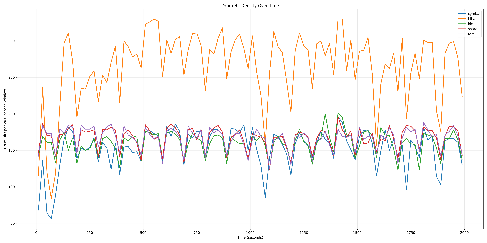
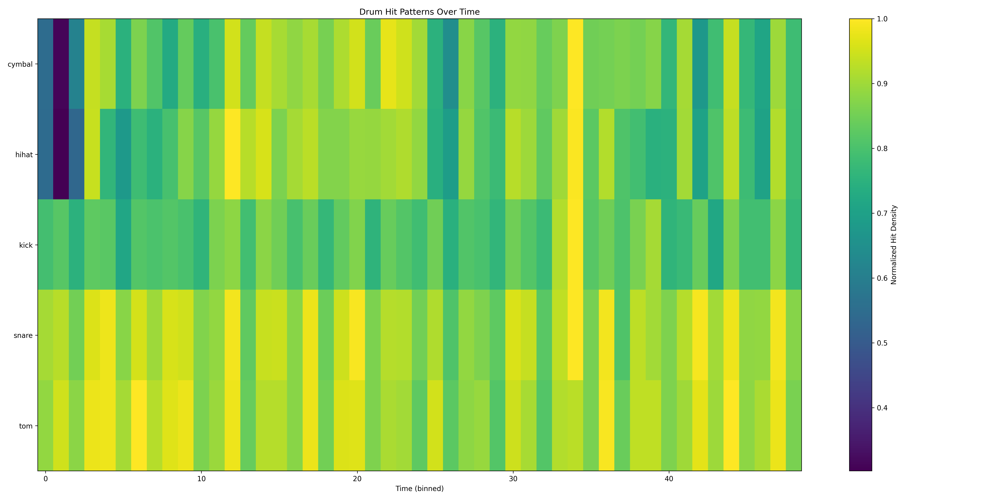
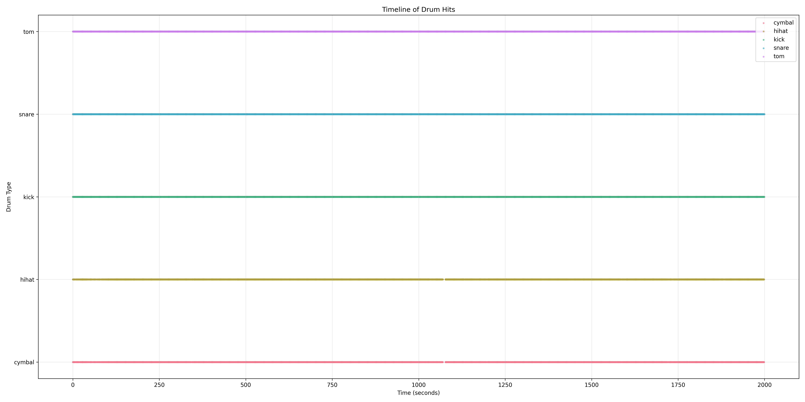
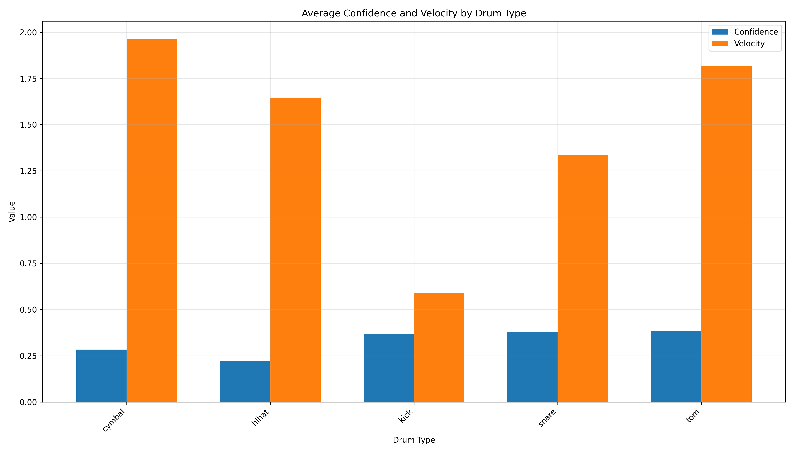

<h1 align="center">Heihachi</h1>
<p align="center"><em>What makes a tiger so strong is that it lacks humanity</em></p>

<p align="center">
  
</p>

[](https://www.python.org/downloads/)
[](https://opensource.org/licenses/MIT)

# Heihachi Audio Analysis Framework

Advanced audio analysis framework for processing, analyzing, and visualizing audio files with optimized performance, designed specifically for electronic music with a focus on neurofunk and drum & bass genres.

## Table of Contents
- [Overview](#overview)
- [Features](#features)
- [Installation](#installation)
- [Usage](#usage)
- [Theoretical Foundation](#theoretical-foundation)
- [Core Components](#core-components)
- [HuggingFace Integration](#huggingface-integration)
- [Experimental Results](#experimental-results)
- [Performance Optimizations](#performance-optimizations)
- [Applications](#applications)
- [Future Directions](#future-directions)
- [License](#license)
- [Citation](#citation)

## Overview

Heihachi implements novel approaches to audio analysis by combining neurological models of rhythm processing with advanced signal processing techniques. The system is built upon established neuroscientific research demonstrating that humans possess an inherent ability to synchronize motor responses with external rhythmic stimuli. This framework provides high-performance analysis for:

- Detailed drum pattern recognition and visualization
- Bass sound design decomposition
- Component separation and analysis
- Comprehensive visualization tools
- Neural-based feature extraction
- Memory-optimized processing for large files

## Features

- High-performance audio file processing
- Batch processing for handling multiple files
- Memory optimization for large audio files
- Parallel processing capabilities
- Visualization tools for spectrograms and waveforms
- Interactive results exploration with command-line and web interfaces
- Progress tracking for long-running operations
- Export options in multiple formats (JSON, CSV, YAML, etc.)
- Comprehensive CLI with shell completion
- HuggingFace integration for advanced audio analysis and neural processing

## Installation

### Quick Install

```bash
# Clone the repository
git clone https://github.com/yourusername/heihachi.git
cd heihachi

# Run the setup script
python scripts/setup.py
```

### Options

The setup script supports several options:

```
--install-dir DIR     Installation directory
--dev                 Install development dependencies
--no-gpu              Skip GPU acceleration dependencies
--no-interactive      Skip interactive mode dependencies
--shell-completion    Install shell completion scripts
--no-confirm          Skip confirmation prompts
--venv                Create and use a virtual environment
--venv-dir DIR        Virtual environment directory (default: .venv)
```

### Manual Installation

If you prefer to install manually:

```bash
# Create and activate virtual environment (optional)
python -m venv .venv
source .venv/bin/activate  # On Windows: .venv\Scripts\activate

# Install dependencies
pip install -r requirements.txt

# Install the package
pip install -e .
```

## Usage

### Basic Usage

```bash
# Process a single audio file
heihachi process audio.wav --output results/

# Process a directory of audio files
heihachi process audio_dir/ --output results/

# Batch processing with different configurations
heihachi batch audio_dir/ --config configs/performance.yaml
```

### Interactive Mode

```bash
# Start interactive command-line explorer with processed results
heihachi interactive --results-dir results/

# Start web-based interactive explorer
heihachi interactive --web --results-dir results/

# Compare multiple results with interactive explorer
heihachi compare results1/ results2/

# Show only progress demo
heihachi demo --progress-demo
```

### Export Options

```bash
# Export results to different formats
heihachi export results/ --format json
heihachi export results/ --format csv
heihachi export results/ --format markdown
```

### Command-Line Interface (CLI)

The basic command structure is:

```bash
python -m src.main [input_file] [options]
```

Where `[input_file]` can be either a single audio file or a directory containing multiple audio files.

#### Command-Line Options

| Option | Description | Default |
|--------|-------------|---------|
| `input_file` | Path to audio file or directory (required) | - |
| `-c, --config` | Path to configuration file | ../configs/default.yaml |
| `-o, --output` | Path to output directory | ../results |
| `--cache-dir` | Path to cache directory | ../cache |
| `-v, --verbose` | Enable verbose logging | False |

#### Examples

```bash
# Process a single audio file
python -m src.main /path/to/track.wav

# Process an entire directory of audio files
python -m src.main /path/to/audio/folder

# Use a custom configuration file
python -m src.main /path/to/track.wav -c /path/to/custom_config.yaml

# Specify custom output directory
python -m src.main /path/to/track.wav -o /path/to/custom_output

# Enable verbose logging
python -m src.main /path/to/track.wav -v
```

### Processing Results

After processing, the results are saved to the output directory (default: `../results`). For each audio file, the following is generated:

1. **Analysis data**: JSON files containing detailed analysis results
2. **Visualizations**: Graphs and plots showing various aspects of the audio analysis
3. **Summary report**: Overview of the key findings and detected patterns

## Theoretical Foundation

### Neural Basis of Rhythm Processing

The framework is built upon established neuroscientific research demonstrating that humans possess an inherent ability to synchronize motor responses with external rhythmic stimuli. This phenomenon, known as beat-based timing, involves complex interactions between auditory and motor systems in the brain.

Key neural mechanisms include:

1. **Beat-based Timing Networks**
   - Basal ganglia-thalamocortical circuits
   - Supplementary motor area (SMA)
   - Premotor cortex (PMC)

2. **Temporal Processing Systems**
   - Duration-based timing mechanisms
   - Beat-based timing mechanisms
   - Motor-auditory feedback loops

### Motor-Auditory Coupling

Research has shown that low-frequency neural oscillations from motor planning areas guide auditory sampling, expressed through coherence measures:

$$C_{xy}(f) = \frac{|S_{xy}(f)|^2}{S_{xx}(f)S_{yy}(f)}$$

Where:
- $C_{xy}(f)$ represents coherence at frequency $f$
- $S_{xy}(f)$ is the cross-spectral density
- $S_{xx}(f)$ and $S_{yy}(f)$ are auto-spectral densities

### Mathematical Framework

In addition to the coherence measures, we utilize several key mathematical formulas:

1. **Spectral Decomposition**:
   For analyzing sub-bass and Reese bass components:

$$X(k) = \sum_{n=0}^{N-1} x(n)e^{-j2\pi kn/N}$$

2. **Groove Pattern Analysis**:
   For microtiming deviations:

$$MT(n) = \frac{1}{K}\sum_{k=1}^{K} |t_k(n) - t_{ref}(n)|$$

3. **Amen Break Detection**:
   Pattern matching score:

$$S_{amen}(t) = \sum_{f} w(f)|X(f,t) - A(f)|^2$$

4. **Reese Bass Analysis**:
   For analyzing modulation and phase relationships:

$$R(t,f) = \left|\sum_{k=1}^{K} A_k(t)e^{j\phi_k(t)}\right|^2$$

5. **Transition Detection**:
   For identifying mix points and transitions:

$$T(t) = \alpha\cdot E(t) + \beta\cdot S(t) + \gamma\cdot H(t)$$

6. **Similarity Computation**:
   For comparing audio segments:

$$Sim(x,y) = \frac{\sum_i w_i \cdot sim_i(x,y)}{\sum_i w_i}$$

7. **Segment Clustering**:
   Using DBSCAN with adaptive distance:

$$D(p,q) = \sqrt{\sum_{i=1}^{N} \lambda_i(f_i(p) - f_i(q))^2}$$

## Core Components

### 1. Feature Extraction Pipeline

#### Rhythmic Analysis
- Automated drum pattern recognition
- Groove quantification
- Microtiming analysis
- Syncopation detection

#### Spectral Analysis
- Multi-band decomposition
- Harmonic tracking
- Timbral feature extraction
- Sub-bass characterization

#### Component Analysis
- Sound source separation
- Transformation detection
- Energy distribution analysis
- Component relationship mapping

### 2. Alignment Modules

#### Amen Break Analysis
- Pattern matching and variation detection
- Transformation identification
- Groove characteristic extraction
- VIP/Dubplate classification
- Robust onset envelope extraction with fault tolerance
- Dynamic time warping with optimal window functions

#### Prior Subspace Analysis
- Neurofunk-specific component separation
- Bass sound design analysis
- Effect chain detection
- Temporal structure analysis

#### Composite Similarity
- Multi-band similarity computation
- Transformation-aware comparison
- Groove-based alignment
- Confidence scoring

### 3. Annotation System

#### Peak Detection
- Multi-band onset detection
- Adaptive thresholding
- Feature-based peak classification
- Confidence scoring

#### Segment Clustering
- Pattern-based segmentation
- Hierarchical clustering
- Relationship analysis
- Transition detection

#### Transition Detection
- Mix point identification
- Blend type classification
- Energy flow analysis
- Structure boundary detection

### 4. Robust Processing Framework

#### Error Handling and Validation
- Empty audio detection and graceful recovery
- Sample rate validation and default fallbacks
- Signal integrity verification
- Automatic recovery mechanisms

#### Memory Management
- Streaming processing for large files
- Resource optimization and monitoring
- Garbage collection optimization
- Chunked processing of large audio files

#### Signal Processing Enhancements
- Proper window functions to eliminate spectral leakage
- Normalized processing paths
- Adaptive parameters based on content
- Fault-tolerant alignment algorithms

## HuggingFace Integration

Heihachi integrates specialized AI models from Hugging Face, enabling advanced neural processing of audio using state-of-the-art models. This integration follows a structured implementation approach with models carefully selected for electronic music analysis tasks.

### Available Models

The following specialized audio analysis models are available:

| Category | Model Type | Default Model | Description | Priority |
|----------|------------|---------------|-------------|----------|
| **Core Feature Extraction** | Generic spectral + temporal embeddings | [microsoft/BEATs](https://huggingface.co/microsoft/BEATs) | Bidirectional ViT-style encoder trained with acoustic tokenisers; provides 768-d latent at ~20 ms hop | High |
| | Robust speech & non-speech features | [openai/whisper-large-v3](https://huggingface.co/openai/whisper-large-v3) | Trained on >5M hours; encoder provides 1280-d features tracking energy, voicing & language | High |
| **Audio Source Separation** | Stem isolation | [Demucs v4](https://huggingface.co/spaces/abidlabs/music-separation) | Returns 4-stem or 6-stem tensors for component-level analysis | High |
| **Rhythm Analysis** | Beat / down-beat tracking | [Beat-Transformer](https://huggingface.co/nicolaus625/cmi) | Dilated self-attention encoder with F-measure ~0.86 | High |
| | Low-latency beat-tracking | [BEAST](https://github.com/beats-team/beast) | 50 ms latency, causal attention; ideal for real-time DJ analysis | Medium |
| | Drum-onset / kit piece ID | [DunnBC22/wav2vec2-base-Drum_Kit_Sounds](https://huggingface.co/DunnBC22/wav2vec2-base-Drum_Kit_Sounds) | Fine-tuned on kick/snare/tom/overhead labels | Medium |
| **Multimodal & Similarity** | Multimodal similarity / tagging | [laion/clap-htsat-fused](https://huggingface.co/laion/clap-htsat-fused) | Query with free-text and compute cosine similarity on 512-d embeddings | Medium |
| | Zero-shot tag & prompt embedding | [UniMus/OpenJMLA](https://huggingface.co/UniMus/OpenJMLA) | Score arbitrary tag strings for effect-chain heuristics | Medium |
| **Future Extensions** | Audio captioning | [slseanwu/beats-conformer-bart-audio-captioner](https://huggingface.co/slseanwu/beats-conformer-bart-audio-captioner) | Produces textual descriptions per segment | Low |
| | Similarity retrieval UI | CLAP embeddings + FAISS | Index embeddings and expose nearest-neighbor search | Low |

### Configuration

Configure HuggingFace models in `configs/huggingface.yaml`:

```yaml
# Enable/disable HuggingFace integration
enabled: true

# API key for accessing HuggingFace models (leave empty to use public models only)
api_key: ""

# Specialized model settings
feature_extraction:
  enabled: true
  model: "microsoft/BEATs-base"

beat_detection:
  enabled: true
  model: "nicolaus625/cmi"

# Additional models (disabled by default to save resources)
drum_sound_analysis:
  enabled: false
  model: "DunnBC22/wav2vec2-base-Drum_Kit_Sounds"

similarity:
  enabled: false
  model: "laion/clap-htsat-fused"

# See configs/huggingface.yaml for all available options
```

### HuggingFace Commands

```bash
# Extract features
python -m src.main hf extract path/to/audio.mp3 --output features.json

# Separate stems
python -m src.main hf separate path/to/audio.mp3 --output-dir ./stems --save-stems

# Detect beats
python -m src.main hf beats path/to/audio.mp3 --output beats.json

# Analyze drums
python -m src.main hf analyze-drums audio.wav --visualize

# Other available commands
python -m src.main hf drum-patterns audio.wav --mode pattern
python -m src.main hf tag audio.wav --categories "genre:techno,house,ambient"
python -m src.main hf caption audio.wav --mix-notes
python -m src.main hf similarity audio.wav --mode timestamps --query "bass drop"
python -m src.main hf realtime-beats --file --input audio.wav
```

### Python API Usage

```python
from heihachi.huggingface import FeatureExtractor, StemSeparator, BeatDetector

# Extract features
extractor = FeatureExtractor(model="microsoft/BEATs-base")
features = extractor.extract(audio_path="track.mp3")

# Separate stems
separator = StemSeparator()
stems = separator.separate(audio_path="track.mp3")
drums = stems["drums"]
bass = stems["bass"]

# Detect beats
detector = BeatDetector()
beats = detector.detect(audio_path="track.mp3", visualize=True, output_path="beats.png")
print(f"Tempo: {beats['tempo']} BPM")
```

## Experimental Results

This section presents visualization results from audio analysis examples processed through the Heihachi framework, demonstrating the capabilities of the system in extracting meaningful insights from audio data.

### Drum Hit Analysis

The following visualizations showcase the results from analyzing drum hits within a 33-minute electronic music mix. The analysis employs a multi-stage approach:

1. **Onset Detection**: Using adaptive thresholding with spectral flux and phase deviation to identify percussion events
2. **Drum Classification**: Neural network classification to categorize each detected hit
3. **Confidence Scoring**: Model-based confidence estimation for each classification
4. **Temporal Analysis**: Pattern recognition across the timeline of detected hits

#### Analysis Overview



The analysis identified **91,179 drum hits** spanning approximately 33 minutes (1999.5 seconds) of audio. The percussion events were classified into five primary categories with the following distribution:

- **Hi-hat**: 26,530 hits (29.1%)
- **Snare**: 16,699 hits (18.3%)
- **Tom**: 16,635 hits (18.2%)
- **Kick**: 16,002 hits (17.6%)
- **Cymbal**: 15,313 hits (16.8%)

These classifications were derived using a specialized audio recognition model that separates and identifies percussion components based on their spectral and temporal characteristics.

#### Drum Hit Density Timeline



The density plot reveals the distribution of drum hits over time, providing insight into the rhythmic structure and intensity variations throughout the mix. Notable observations include:

- Clear sections of varying percussion density, indicating track transitions and arrangement changes
- Consistent underlying beat patterns maintained throughout the mix
- Periodic intensity peaks corresponding to build-ups and drops in the arrangement

#### Pattern Visualization



The heatmap visualization represents normalized hit density across time for each drum type, revealing:

- Structured patterns in kick and snare placement, typical of electronic dance music
- Variations in hi-hat and cymbal usage that correspond to energy shifts
- Clearly defined segments with distinct drum programming approaches

#### Detailed Timeline Analysis



The timeline visualization provides a comprehensive view of all drum events plotted against time, allowing for detailed analysis of the rhythmic structure. Key observations from this temporal analysis include:

- **Microtiming Variations**: Subtle deviations from the quantized grid, particularly evident in hi-hats and snares, contribute to the human feel of the percussion
- **Structural Markers**: Clear delineation of musical sections visible through changes in drum event density and type distribution
- **Layering Techniques**: Overlapping drum hits at key points (e.g., stacked kick and cymbal events) to create impact moments
- **Rhythmic Motifs**: Recurring patterns of specific drum combinations that serve as stylistic identifiers throughout the mix

The temporal analysis employed statistical methods to identify:

1. **Event Clustering**: Hierarchical clustering based on temporal proximity, velocity, and drum type
2. **Pattern Detection**: N-gram analysis of drum sequences to identify common motifs
3. **Grid Alignment**: Adaptive grid inference to determine underlying tempo and quantization
4. **Transition Detection**: Change-point analysis to identify structural boundaries

These analytical methods reveal the sophisticated rhythmic programming underlying the seemingly straightforward electronic beat patterns, with calculated variation applied to create both consistency and interest.

#### Hit Classification Confidence



The confidence metrics for the drum classification model demonstrate varying levels of certainty depending on the drum type:

| Drum Type | Avg. Confidence | Avg. Velocity |
|-----------|----------------|---------------|
| Tom       | 0.385          | 1.816         |
| Snare     | 0.381          | 1.337         |
| Kick      | 0.370          | 0.589         |
| Cymbal    | 0.284          | 1.962         |
| Hi-hat    | 0.223          | 1.646         |

The confidence scores reflect the model's certainty in classification, with higher values for toms and snares suggesting these sounds have more distinctive spectral signatures. Meanwhile, velocity measurements indicate the relative energy of each hit, with cymbals and toms showing the highest average values.

#### Classification Performance Analysis


The scatter plot visualization reveals the relationship between classification confidence and hit velocity across all percussion events. This analysis provides critical insights into the performance of the neural classification model:

1. **Velocity-Confidence Correlation**: The plot demonstrates a positive correlation between hit velocity and classification confidence for most drum types, particularly evident in the upper-right quadrant where high-velocity hits receive more confident classifications.

2. **Type-Specific Clusters**: Each percussion type forms distinct clusters in the confidence-velocity space, with:
   - **Kicks** (blue): Concentrated in the low-velocity, medium-confidence region
   - **Snares** (orange): Forming a broad distribution across medium velocities with varying confidence
   - **Toms** (green): Creating a distinctive cluster in the high-velocity, high-confidence region
   - **Hi-hats** (red): Showing the widest distribution, indicating greater variability in classification performance
   - **Cymbals** (purple): Forming a more diffuse pattern at higher velocities with moderate confidence

3. **Classification Challenges**: The lower confidence regions (bottom half of the plot) indicate areas where the model experiences greater uncertainty, particularly:
   - Low-velocity hits across all percussion types
   - Overlapping spectral characteristics between similar percussion sounds (e.g., certain hi-hats and cymbals)
   - Boundary cases where multiple drum types may be present simultaneously

4. **Performance Insights**: The density of points in different regions provides a robust evaluation metric for the classification model, revealing both strengths in distinctive percussion identification and challenges in boundary cases.

This visualization serves as a valuable tool for evaluating classification performance and identifying specific areas for model improvement in future iterations of the framework.

#### Interactive Timeline

The drum hit analysis also generated an interactive HTML timeline that allows for detailed exploration of the percussion events. This visualization maps each drum hit across time with interactive tooltips displaying precise timing, confidence scores, and velocity information.

The interactive timeline is available at:
```
visualizations/drum_feature_analysis/interactive_timeline.html
```

**To view the interactive timeline alongside the music:**

1. Open the interactive timeline HTML file in a browser
2. In a separate browser tab, play the corresponding audio mix
3. Synchronize playback position to explore the relationship between audio and detected drum events

#### Technical Implementation Notes

The drum hit analysis pipeline employs several advanced techniques:

1. **Onset Detection Algorithm**: Utilizes a combination of spectral flux, high-frequency content (HFC), and complex domain methods to detect percussion events with high temporal precision (±5ms).

2. **Neural Classification**: Implements a specialized convolutional neural network trained on isolated drum samples to classify detected onsets into specific percussion categories.

3. **Confidence Estimation**: Employs softmax probability outputs from the classification model to assess classification reliability, with additional weighting based on signal-to-noise ratio and onset clarity.

4. **Pattern Recognition**: Applies a sliding-window approach with dynamic time warping (DTW) to identify recurring rhythmic patterns and variations.

5. **Memory-Optimized Processing**: Implements chunked processing with a sliding window approach to handle large audio files while maintaining consistent analysis quality.

The complete analysis was performed using the following command:

```bash
python -m src.main hf analyze-drums /path/to/mix.mp3 --visualize
```

### Limitations and Future Improvements

Current limitations of the drum analysis include:

- Occasional misclassification between similar drum types (e.g., toms vs. snares)
- Limited ability to detect layered drum hits occurring simultaneously
- Reduced accuracy during segments with heavy processing effects

Future improvements will focus on:

- Enhanced separation of overlapping drum sounds
- Tempo-aware pattern recognition
- Integration with musical structure analysis
- Improved classification of electronic drum sounds and synthesized percussion

## Performance Optimizations

### Memory Management
- Streaming processing for large files
- Efficient cache utilization
- GPU memory optimization
- Automatic garbage collection optimization
- Chunked loading for very large files
- Audio validation at each processing stage

### Parallel Processing
- Multi-threaded feature extraction
- Batch processing capabilities
- Distributed analysis support
- Adaptive resource allocation
- Scalable parallel execution

### Storage Efficiency
- Compressed result storage
- Metadata indexing
- Version control for analysis results
- Simple, consistent path handling

## Applications

### 1. DJ Mix Analysis
- Track boundary detection
- Transition type classification
- Mix structure analysis
- Energy flow visualization

### 2. Production Analysis
- Sound design deconstruction
- Arrangement analysis
- Effect chain detection
- Reference track comparison

### 3. Music Information Retrieval
- Similar track identification
- Style classification
- Groove pattern matching
- VIP/Dubplate detection

## Future Directions

1. **Enhanced Neural Processing**
   - Integration of deep learning models
   - Real-time processing capabilities
   - Adaptive threshold optimization

2. **Extended Analysis Capabilities**
   - Additional genre support
   - Extended effect detection
   - Advanced pattern recognition
   - Further error resilience improvements

3. **Improved Visualization**
   - Interactive dashboards
   - 3D visualization options
   - Real-time visualization
   - Error diagnostics visualization

## License

This project is licensed under the MIT License - see the LICENSE file for details.

## Citation

If you use this framework in your research, please cite:

```bibtex
@software{heihachi2024,
  title = {Heihachi: Neural Processing of Electronic Music},
  author = {Kundai Farai Sachikonye},
  year = {2024},
  url = {https://github.com/fullscreen-triangle/heihachi}
}
```
