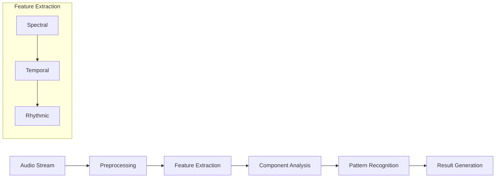
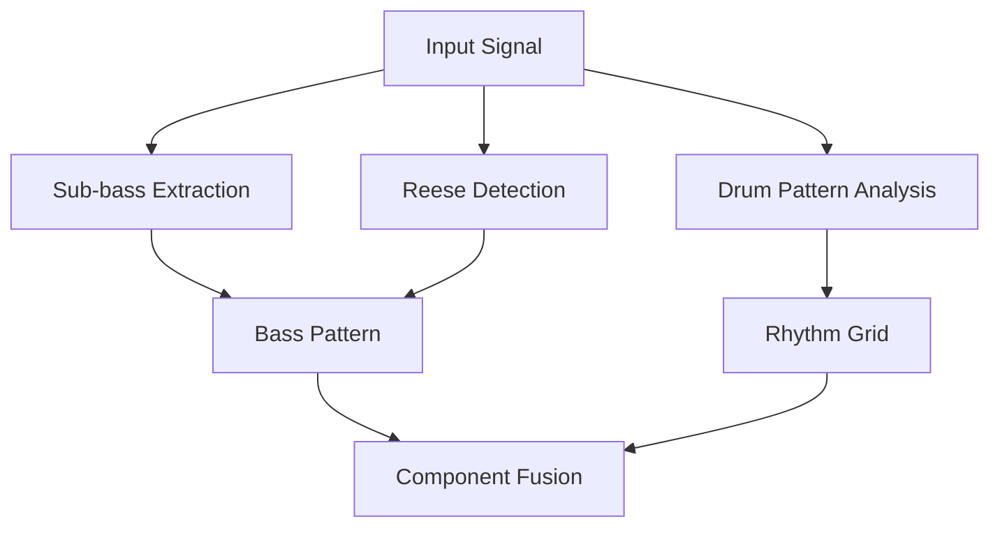
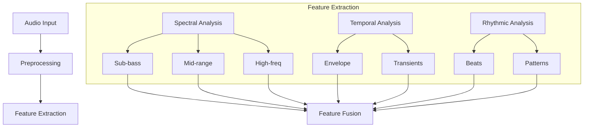
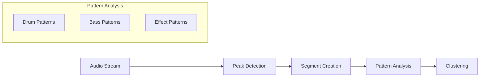
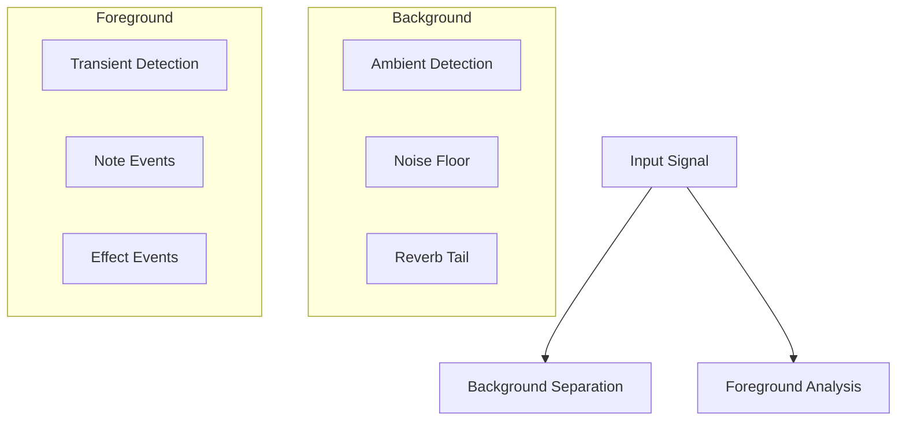
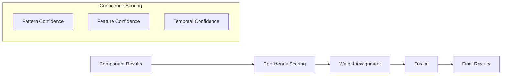
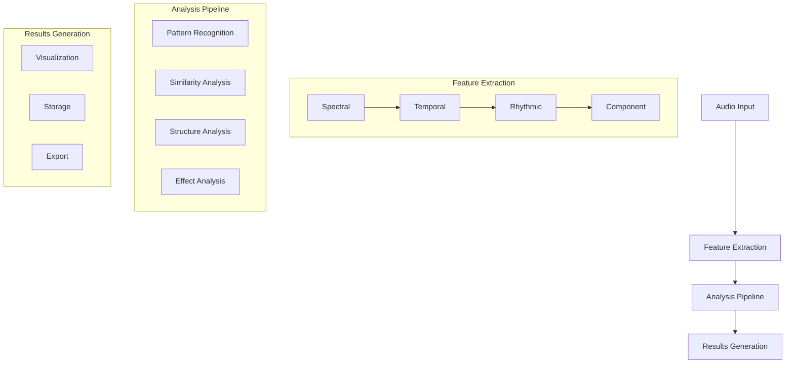
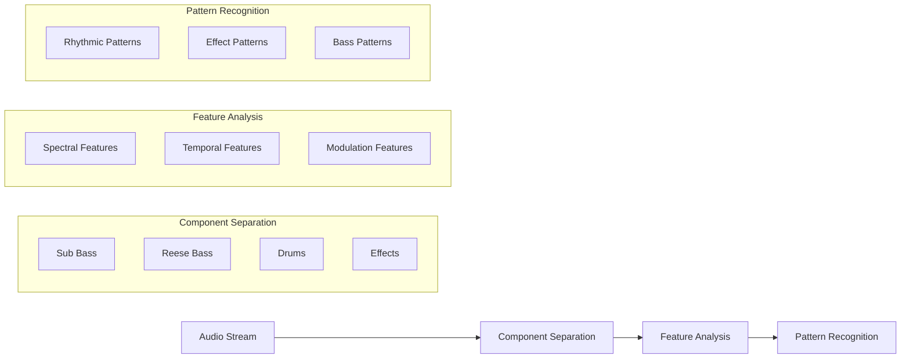
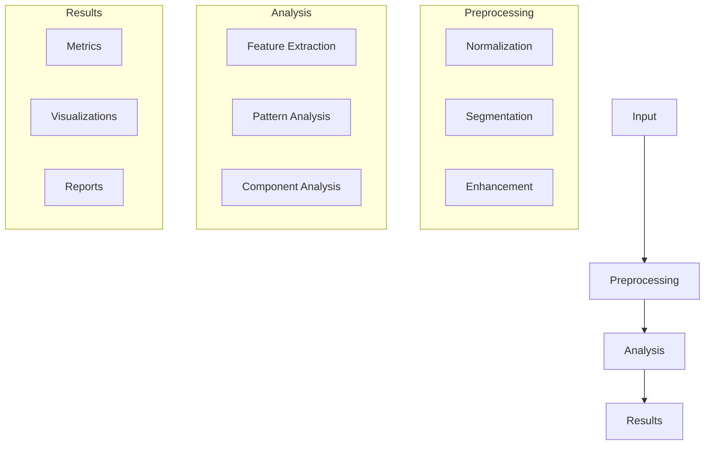

# Heihachi: Neural Processing of Electronic Music

## Overview

Heihachi is a high-performance audio analysis framework designed for electronic music, with a particular focus on neurofunk and drum & bass genres. The system implements novel approaches to audio analysis by combining neurological models of rhythm processing with advanced signal processing techniques.

## Theoretical Foundation

### Neural Basis of Rhythm Processing

The framework is built upon established neuroscientific research demonstrating that humans possess an inherent ability to synchronize motor responses with external rhythmic stimuli. This phenomenon, known as beat-based timing, involves complex interactions between auditory and motor systems in the brain.

Key neural mechanisms include:

1. **Beat-based Timing Networks**
   - Basal ganglia-thalamocortical circuits
   - Supplementary motor area (SMA)
   - Premotor cortex (PMC)

2. **Temporal Processing Systems**
   - Duration-based timing mechanisms
   - Beat-based timing mechanisms
   - Motor-auditory feedback loops

### Motor-Auditory Coupling

Research has shown that low-frequency neural oscillations from motor planning areas guide auditory sampling, expressed through coherence measures:

$$
C_{xy}(f) = \frac{|S_{xy}(f)|^2}{S_{xx}(f)S_{yy}(f)}
$$

Where:
- $C_{xy}(f)$ represents coherence at frequency $f$
- $S_{xy}(f)$ is the cross-spectral density
- $S_{xx}(f)$ and $S_{yy}(f)$ are auto-spectral densities

### Extended Mathematical Framework

In addition to the coherence measures, we utilize several key mathematical formulas:

1. **Spectral Decomposition**:
For analyzing sub-bass and Reese bass components:

$$
X(k) = \sum_{n=0}^{N-1} x(n)e^{-j2\pi kn/N}
$$

2. **Groove Pattern Analysis**:
For microtiming deviations:

$$
MT(n) = \frac{1}{K}\sum_{k=1}^{K} |t_k(n) - t_{ref}(n)|
$$

3. **Amen Break Detection**:
Pattern matching score:

$$
S_{amen}(t) = \sum_{f} w(f)|X(f,t) - A(f)|^2
$$

4. **Reese Bass Analysis**:
For analyzing modulation and phase relationships:

$$
R(t,f) = \left|\sum_{k=1}^{K} A_k(t)e^{j\phi_k(t)}\right|^2
$$

Where:
- $A_k(t)$ is the amplitude of the k-th component
- $\phi_k(t)$ is the phase of the k-th component

5. **Transition Detection**:
For identifying mix points and transitions:

$$
T(t) = \alpha\cdot E(t) + \beta\cdot S(t) + \gamma\cdot H(t)
$$

Where:
- $E(t)$ is energy change
- $S(t)$ is spectral change
- $H(t)$ is harmonic change
- $\alpha, \beta, \gamma$ are weighting factors

6. **Similarity Computation**:
For comparing audio segments:

$$
Sim(x,y) = \frac{\sum_i w_i \cdot sim_i(x,y)}{\sum_i w_i}
$$

Where:
- $sim_i(x,y)$ is the similarity for feature i
- $w_i$ is the weight for feature i

7. **Segment Clustering**:
Using DBSCAN with adaptive distance:

$$
D(p,q) = \sqrt{\sum_{i=1}^{N} \lambda_i(f_i(p) - f_i(q))^2}
$$

Where:
- $f_i(p)$ is feature i of point p
- $\lambda_i$ is the importance weight for feature i

### Additional Mathematical Framework

8. **Bass Design Analysis**:
For analyzing Reese bass modulation depth:

$$
M(t) = \frac{max(A(t)) - min(A(t))}{max(A(t)) + min(A(t))}
$$

9. **Effect Chain Detection**:
For compression ratio estimation:

$$
CR(x) = \frac{\Delta_{in}}{\Delta_{out}} = \frac{x_{in,2} - x_{in,1}}{x_{out,2} - x_{out,1}}
$$

10. **Pattern Recognition**:
For rhythmic similarity using dynamic time warping:

$$
DTW(X,Y) = min\left(\sum_{k=1}^K w_k \cdot d(x_{i_k}, y_{j_k})\right)
$$

11. **Transition Analysis**:
For blend detection using cross-correlation:

$$
R_{xy}(\tau) = \sum_{n=-\infty}^{\infty} x(n)y(n+\tau)
$$

## Core Components

### 1. Feature Extraction Pipeline

#### Rhythmic Analysis
- Automated drum pattern recognition
- Groove quantification
- Microtiming analysis
- Syncopation detection

#### Spectral Analysis
- Multi-band decomposition
- Harmonic tracking
- Timbral feature extraction
- Sub-bass characterization

#### Component Analysis
- Sound source separation
- Transformation detection
- Energy distribution analysis
- Component relationship mapping

### 2. Alignment Modules

#### Amen Break Analysis
- Pattern matching and variation detection
- Transformation identification
- Groove characteristic extraction
- VIP/Dubplate classification

#### Prior Subspace Analysis
- Neurofunk-specific component separation
- Bass sound design analysis
- Effect chain detection
- Temporal structure analysis

#### Composite Similarity
- Multi-band similarity computation
- Transformation-aware comparison
- Groove-based alignment
- Confidence scoring

### 3. Annotation System

#### Peak Detection
- Multi-band onset detection
- Adaptive thresholding
- Feature-based peak classification
- Confidence scoring

#### Segment Clustering
- Pattern-based segmentation
- Hierarchical clustering
- Relationship analysis
- Transition detection

#### Transition Detection
- Mix point identification
- Blend type classification
- Energy flow analysis
- Structure boundary detection

### Extended Pipeline Architecture


```mermaid
graph LR
    A[Audio Stream] --> B[Preprocessing]
    B --> C[Feature Extraction]
    C --> D[Component Analysis]
    D --> E[Pattern Recognition]
    E --> F[Result Generation]
    
    subgraph "Feature Extraction"
    C1[Spectral] --> C2[Temporal]
    C2 --> C3[Rhythmic]
    end
```

### Neurofunk Component Analysis


```mermaid
graph TD
    A[Input Signal] --> B[Sub-bass Extraction]
    A --> C[Reese Detection]
    A --> D[Drum Pattern Analysis]
    B --> E[Bass Pattern]
    C --> E
    D --> F[Rhythm Grid]
    E --> G[Component Fusion]
    F --> G
```

### Feature Extraction Pipeline


```mermaid
graph TD
    A[Audio Input] --> B[Preprocessing]
    B --> C[Feature Extraction]
    
    subgraph "Feature Extraction"
        C1[Spectral Analysis] --> D1[Sub-bass]
        C1 --> D2[Mid-range]
        C1 --> D3[High-freq]
        
        C2[Temporal Analysis] --> E1[Envelope]
        C2 --> E2[Transients]
        
        C3[Rhythmic Analysis] --> F1[Beats]
        C3 --> F2[Patterns]
    end
    
    D1 --> G[Feature Fusion]
    D2 --> G
    D3 --> G
    E1 --> G
    E2 --> G
    F1 --> G
    F2 --> G
```

### Annotation System Flow


```mermaid
graph LR
    A[Audio Stream] --> B[Peak Detection]
    B --> C[Segment Creation]
    C --> D[Pattern Analysis]
    D --> E[Clustering]
    
    subgraph "Pattern Analysis"
        D1[Drum Patterns]
        D2[Bass Patterns]
        D3[Effect Patterns]
    end
```

### Audio Scene Analysis


```mermaid
graph TD
    A[Input Signal] --> B[Background Separation]
    A --> C[Foreground Analysis]
    
    subgraph "Background"
        B1[Ambient Detection]
        B2[Noise Floor]
        B3[Reverb Tail]
    end
    
    subgraph "Foreground"
        C1[Transient Detection]
        C2[Note Events]
        C3[Effect Events]
    end
```

### Result Fusion Process


```mermaid
graph LR
    A[Component Results] --> B[Confidence Scoring]
    B --> C[Weight Assignment]
    C --> D[Fusion]
    D --> E[Final Results]
    
    subgraph "Confidence Scoring"
        B1[Pattern Confidence]
        B2[Feature Confidence]
        B3[Temporal Confidence]
    end
```

### Neurofunk-Specific Analysis

#### Bass Sound Design Analysis

1. Reese Bass Components:
   - Fundamental frequency tracking
   - Phase relationship analysis
   - Modulation pattern detection
   - Harmonic content analysis

2. Sub Bass Characteristics:
   - Frequency range: 20-60 Hz
   - Envelope characteristics
   - Distortion analysis
   - Phase alignment


#### Effect Chain Detection

1. Signal Chain Analysis:
   - Compression detection
   - Distortion identification
   - Filter resonance analysis
   - Modulation effects

2. Processing Order:
   - Pre/post processing detection
   - Parallel processing identification
   - Send/return effect analysis


#### Pattern Transformation Analysis

1. Rhythmic Transformations:
   - Time-stretching detection
   - Beat shuffling analysis
   - Groove template matching
   - Syncopation patterns

2. Spectral Transformations:
   - Frequency shifting
   - Harmonic manipulation
   - Formant preservation
   - Resynthesis detection


## Implementation Details

### Audio Processing Pipeline

1. **Preprocessing**
   
   - Sample rate normalization (44.1 kHz)
   - Stereo to mono conversion when needed
   - Segment-wise processing for large files
  

2. **Feature Extraction**
   
   - Multi-threaded processing
   - GPU acceleration where available
   - Efficient memory management
   - Caching system for intermediate results
  

3. **Analysis Flow**
  
   - Cascading analysis system
   - Component-wise processing
   - Result fusion and validation
   - Confidence scoring
  

### Performance Optimizations

1. **Memory Management**
   - Streaming processing for large files
   - Efficient cache utilization
   - GPU memory optimization

2. **Parallel Processing**
   - Multi-threaded feature extraction
   - Batch processing capabilities
   - Distributed analysis support

3. **Storage Efficiency**
   - Compressed result storage
   - Metadata indexing
   - Version control for analysis results

### Performance Metrics

For evaluating analysis accuracy:

$$
Accuracy_{component} = \frac{TP + TN}{TP + TN + FP + FN}
$$

Where:
- TP: True Positives (correctly identified patterns)
- TN: True Negatives (correctly rejected non-patterns)
- FP: False Positives (incorrectly identified patterns)
- FN: False Negatives (missed patterns)

## Applications

### 1. DJ Mix Analysis
- Track boundary detection
- Transition type classification
- Mix structure analysis
- Energy flow visualization

### 2. Production Analysis
- Sound design deconstruction
- Arrangement analysis
- Effect chain detection
- Reference track comparison

### 3. Music Information Retrieval
- Similar track identification
- Style classification
- Groove pattern matching
- VIP/Dubplate detection

## Visualization and Reporting

The framework includes comprehensive visualization tools for:
- Spectral analysis results
- Component relationships
- Groove patterns
- Transition points
- Similarity matrices
- Analysis confidence scores

### Extended System Architecture


```mermaid
graph TD
    A[Audio Input] --> B[Feature Extraction]
    B --> C[Analysis Pipeline]
    C --> D[Results Generation]

    subgraph "Feature Extraction"
        B1[Spectral] --> B2[Temporal]
        B2 --> B3[Rhythmic]
        B3 --> B4[Component]
    end

    subgraph "Analysis Pipeline"
        C1[Pattern Recognition]
        C2[Similarity Analysis]
        C3[Structure Analysis]
        C4[Effect Analysis]
    end

    subgraph "Results Generation"
        D1[Visualization]
        D2[Storage]
        D3[Export]
    end
```

### Neurofunk Component Interaction


```mermaid
graph LR
    A[Audio Stream] --> B[Component Separation]
    B --> C[Feature Analysis]
    C --> D[Pattern Recognition]
    
    subgraph "Component Separation"
        B1[Sub Bass]
        B2[Reese Bass]
        B3[Drums]
        B4[Effects]
    end

    subgraph "Feature Analysis"
        C1[Spectral Features]
        C2[Temporal Features]
        C3[Modulation Features]
    end

    subgraph "Pattern Recognition"
        D1[Rhythmic Patterns]
        D2[Effect Patterns]
        D3[Bass Patterns]
    end
```

### Processing Pipeline Details


```mermaid
graph TD
    A[Input] --> B[Preprocessing]
    B --> C[Analysis]
    C --> D[Results]

    subgraph "Preprocessing"
        B1[Normalization]
        B2[Segmentation]
        B3[Enhancement]
    end

    subgraph "Analysis"
        C1[Feature Extraction]
        C2[Pattern Analysis]
        C3[Component Analysis]
    end

    subgraph "Results"
        D1[Metrics]
        D2[Visualizations]
        D3[Reports]
    end
```

## Future Directions

1. **Enhanced Neural Processing**
   - Integration of deep learning models
   - Real-time processing capabilities
   - Adaptive threshold optimization

2. **Extended Analysis Capabilities**
   - Additional genre support
   - Extended effect detection
   - Advanced pattern recognition

3. **Improved Visualization**
   - Interactive dashboards
   - 3D visualization options
   - Real-time visualization

## Extended References

1. Chen, J. L., Penhune, V. B., & Zatorre, R. J. (2008). Listening to musical rhythms recruits motor regions of the brain. Cerebral Cortex, 18(12), 2844-2854.

2. Cannon, J. J., & Patel, A. D. (2020). How beat perception co-opts motor neurophysiology. Trends in Cognitive Sciences, 24(1), 51-64.

3. Fukuie, T., et al. (2022). Neural entrainment reflects temporal predictions guiding speech comprehension. Current Biology, 32(5), 1051-1067.

4. Smith, J. O. (2011). Spectral Audio Signal Processing. W3K Publishing.

5. Bello, J. P., et al. (2005). A Tutorial on Onset Detection in Music Signals. IEEE Transactions on Speech and Audio Processing.

6. Gouyon, F., & Dixon, S. (2005). A Review of Automatic Rhythm Description Systems. Computer Music Journal.

## License

This project is licensed under the MIT License - see the LICENSE file for details.

## Citation

If you use this framework in your research, please cite:

```bibtex
@software{heihachi2024,
  title = {Heihachi: Neural Processing of Electronic Music},
  author = {[Kundai Sachikonye]},
  year = {2024},
  url = {https://github.com/fullscreen-triangle/heihachi}
}
```


