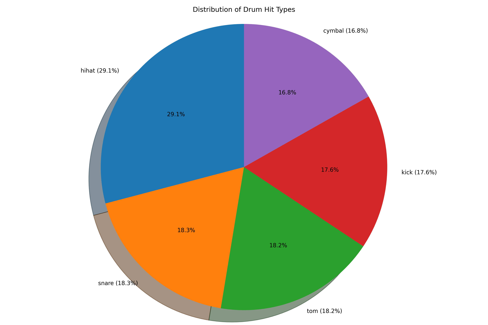
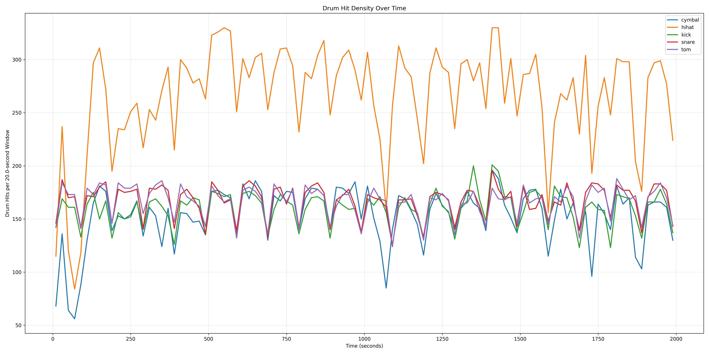
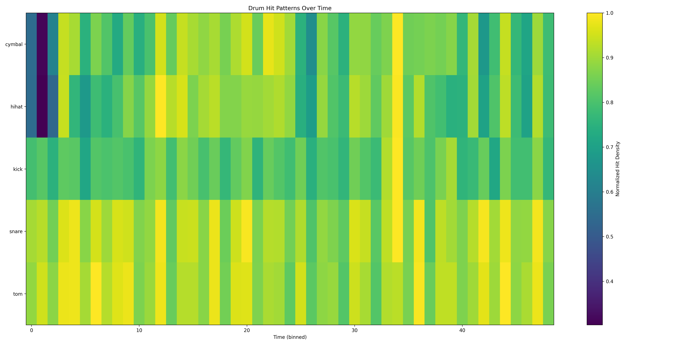

<h1 align="center">Heihachi</h1>

<p align="center">
  
</p>

[](https://www.python.org/downloads/)
[](https://opensource.org/licenses/MIT)

## Abstract

Heihachi is an audio analysis and synthesis framework that implements the Categorical Audio Transport (CAT) specification. The framework treats audio signals as bounded oscillatory systems in finite phase space, where each signal carries two orthogonal information channels: the physical channel (PCM samples, bounded by sampling rate and Gabor uncertainty) and a categorical channel (partition coordinates and S-entropy trajectories, independent of sampling parameters). The categorical channel enables inter-sample trajectory recovery, simultaneous time-frequency precision beyond the Gabor limit, and objective groove quantification through Riemannian geometry on S-entropy space.

The system expresses audio as a thermodynamic gas ensemble, where oscillatory modes are molecular degrees of freedom, partition coordinates $(n, \ell, m, s)$ encode the categorical state at each temporal position, and S-entropy coordinates $(S_k, S_t, S_e)$ provide a continuous representation on a three-dimensional manifold. This representation enables a key result: **similarity between audio signals is computed as interference** between their categorical spectra, not as distance in an embedding space.

The framework comprises three layers: a Rust-accelerated signal processing core, a Python analysis and distillation pipeline, and a browser-based GPU observation apparatus (WebGL/WebGPU shaders) that renders categorical state in real time. A companion web application (honbasho) provides a search-engine-style player with liquid-distortion visualization, Spotify integration, and an interference-based track similarity system.

A separate subsystem, [micro-kernel](./micro-kernel), addresses production rather than analysis. It records the decisions taken while a record is made — what was tried, what was measured, and what was rejected — in a runtime graph that accumulates across sessions. Two domain-specific languages run on that graph: `mishima` (`.mma`) for querying accumulated work, and `sangoma` (`.sgn`) for declaring a sound by the properties it must satisfy rather than by the steps that produce it. The subsystem ships a Rust daemon and a browser-based editor, and is documented in three self-contained manuscripts with an accompanying validation suite. See [§10](#10-micro-kernel-production-runtime).

## 1. Theoretical Foundation

### 1.1 Categorical Audio State Space

Following the CAT specification (Sachikonye, 2026), the categorical state space of an audio signal is the product:

$$\mathcal{C} = \mathcal{S} \times \mathcal{P}$$

where $\mathcal{S} = \{(S_k, S_t, S_e) \in \mathbb{R}_{\geq 0}^3\}$ is the continuous S-entropy coordinate space and $\mathcal{P} = \{(n, \ell, m, s)\}$ is the discrete partition coordinate space.

**S-Entropy Coordinates** (Definition 3.2): For an audio signal $x(t)$:

$$S_k = k_B \ln\!\left(\frac{|\delta\phi| + \phi_0}{\phi_0}\right), \quad S_t = k_B \ln\!\left(\frac{\tau}{\tau_0}\right), \quad S_e = k_B \ln\!\left(\frac{E + E_0}{E_0}\right)$$

where $\delta\phi$ is the phase deviation from a reference oscillator (spectral complexity), $\tau$ is the categorical period (temporal granularity), and $E$ is the instantaneous signal energy (dynamic range).

**Partition Coordinates** (Definition 3.4): Each oscillatory mode is addressed by a 4-tuple $(n, \ell, m, s)$ where $n$ is the partition depth (distinguishable amplitude levels), $\ell \in \{0, \ldots, n{-}1\}$ is the harmonic order, $m \in \{-\ell, \ldots, +\ell\}$ is the phase index, and $s \in \{-\frac{1}{2}, +\frac{1}{2}\}$ is the chirality. The total degeneracy at depth $n$ is $g_n = 2n^2$.

### 1.2 Triple Equivalence

The framework derives from two axioms (bounded phase space and categorical observation) that three descriptions of any persistent dynamical system are equivalent:

| Representation | State Count | Audio Interpretation |
|---|---|---|
| **Oscillatory** | Frequency, phase, amplitude | Physical signal |
| **Categorical** | Partition cell occupancy | Information-theoretic state |
| **Partitional** | Coordinates $(n, \ell, m, s)$ | Structured address |

These yield identical state counts $\Omega_{\text{osc}} = \Omega_{\text{cat}} = \Omega_{\text{part}} = n^M$ and entropies $S = k_B M \ln n$. Since observation = computation = partitioning (o=c=p), a GPU fragment shader reading partition state simultaneously computes all three representations in a single texture fetch.

### 1.3 Similarity as Interference

Two audio signals expressed as categorical spectra (collections of oscillator phases across partition classes) have a natural similarity measure: **interference visibility**.

$$V = \left|\frac{1}{N} \sum_{k=1}^{N} e^{i(\Phi_{A,k} - \Phi_{B,k})}\right|$$

where $\Phi_{A,k}$ and $\Phi_{B,k}$ are the accumulated phases of tracks A and B in oscillator class $k$. High visibility ($V \to 1$) indicates constructive interference (similar tracks). Low visibility ($V \to 0$) indicates destructive interference (dissimilar tracks). No matching algorithm, embedding space, or distance metric is required. The physics of superposition performs the comparison.

### 1.4 Groove Metric

Expressive micro-timing (groove) is formalized as geodesic deviation in S-entropy space. The Riemannian metric tensor $G$ on the S-entropy manifold has components:

$$g_{kk} = \frac{1}{S_k + \epsilon}, \quad g_{tt} = \frac{1}{S_t + \epsilon}, \quad g_{ee} = \frac{1}{S_e + \epsilon}, \quad g_{kt} = \frac{1}{2}\sqrt{S_k S_t}$$

The geodesic distance between two rhythmic events quantifies the groove deviation with resolution independent of sample rate, providing the first physics-based measure of rhythmic feel.

### 1.5 Gabor Bypass

The S-entropy coordinates provide simultaneous time and frequency precision beyond the Gabor limit:

$$\delta S_k \cdot \delta S_t \sim \frac{2\pi k_B^2}{n^2 \phi_0} \to 0 \quad \text{as} \quad n \to \infty$$

This does not violate the Gabor-Heisenberg uncertainty principle because S-entropy coordinates are categorical observables, not physical observables. The commutation relation $[\hat{O}_{\text{cat}}, \hat{O}_{\text{phys}}] = 0$ ensures categorical precision is orthogonal to physical precision.

## 2. System Architecture

### 2.1 Processing Core (Rust + Python)

```
Audio File → Signal Processing (Rust) → Feature Extraction → Categorical State
                                                                    ↓
                      ┌─────────────────────────────────────────────┤
                      ↓                                             ↓
            S-Entropy Trajectory                           Partition Coordinates
            (Sk, St, Se) per frame                         (n, ℓ, m, s) per mode
                      ↓                                             ↓
              Groove Metric                                Phase Spectrum
          (Riemannian distance)                        (8 oscillator classes)
                      ↓                                             ↓
                      └──────────────┬──────────────────────────────┘
                                     ↓
                          Track Observation JSON
                     (structured categorical state)
```

**Rust Core**: Thermodynamic calculations, molecular physics simulation, equilibrium restoration, real-time signal processing. Provides 15-25x speed improvement over pure Python for spectral decomposition and partition coordinate computation.

**Python Interface**: PyO3 bindings for audio analysis, batch processing, REST API, and HuggingFace model integration.

### 2.2 GPU Observation Apparatus (WebGL)

The browser-based renderer implements four observation modes as fragment shaders:

| Mode | Shader | Paper Reference | Output |
|---|---|---|---|
| **Partition Observation** | Synthesizes categorical waveform from $(n, \ell, m, s)$ | Theorem 5.1 | Waveform reconstruction |
| **Gabor Bypass** | Categorical time-frequency representation | Theorem 6.1 | Simultaneous time-frequency precision |
| **Groove Metric** | Riemannian distance on S-entropy manifold | Section 7 | Geodesic deviation field |
| **S-Entropy Manifold** | 3D $(S_k, S_t, S_e)$ trajectory | Definition 3.2 | Phase space topology |

CPU computes S-entropy from Web Audio API analyser data. GPU renders the categorical state. The rendered texture IS the categorical observation, not a visualization of it.

### 2.3 Liquid Distortion (Water-Surface Interference)

Album artwork is rendered through a water-surface displacement shader driven by audio frequency data. The displacement field is the physical interference pattern of the audio signal's oscillatory content:

- **Bass** drives large surface waves (ocean swell)
- **Mid** drives secondary wave interference patterns
- **Treble** drives fine capillary wave detail
- **Volume** drives concentric water-droplet ripples (caustics)

Post-processing applies chromatic aberration proportional to distortion magnitude and vignette framing. For playlists, transitions between tracks use a displacement wave wash effect.

### 2.4 Interference-Based Track Similarity

Each track accumulates a `TrackSpectrum` during playback: S-entropy statistics (mean, standard deviation), partition depth histogram, and phase accumulator across 8 oscillator classes. Similarity between any two tracks is computed as interference visibility of their phase spectra. No training, no embeddings, no feature engineering.

### 2.5 Expert Query Generation (Purpose Pipeline)

The [Purpose framework](https://github.com/fullscreen-triangle/purpose) generates stratified expert queries from categorical observations for LLM articulation:

| Depth | Query Type | Example |
|---|---|---|
| **Basic** | Factual | "What is the dominant partition depth and what does it indicate?" |
| **Intermediate** | Analytical | "What does the temporal entropy trajectory reveal about groove?" |
| **Advanced** | Synthesis | "Characterize the S-entropy region this track occupies." |
| **Expert** | Research-level | "Analyze the phase spectrum across 8 oscillator classes." |

The LLM does not perform matching. The interference shader already computes similarity. The LLM **articulates** the result: explaining why two tracks interfere constructively or destructively in terms of categorical properties, not genre labels.

## 3. Web Application

The [honbasho](./honbasho) directory contains the Next.js web application deployed on Vercel.

### 3.1 Player / Search Engine

The `/player` page functions as an audio search engine:

1. **Search**: Spotify OAuth PKCE integration for searching and streaming tracks
2. **Display**: Album artwork rendered through the liquid distortion shader
3. **Playback**: Jukebox-style transport with auto-advance and skip controls
4. **Observation**: Real-time categorical state extraction during playback
5. **Comparison**: Interference visibility between observed tracks

Local fallback playlist includes 5 drum & bass / neurofunk reference tracks with album artwork.

### 3.2 Landing Page (3D Desk Scene)

The homepage renders a 3D computer desk scene (GLB model) with:
- Audio-reactive twist deformation via `onBeforeCompile` vertex shader injection
- GIF textures on monitor screens with per-screen audio-reactive fragment shaders (twist, glitch, chromatic aberration, pixelate, RGB split)
- GSAP-driven explosion/reassembly animation
- Audio-reactive LED color and scale pulsing

### 3.3 Categorical Observation Modes

The `/player` page supports multiple visualization backends:
- **Desk**: 3D computer scene with audio-reactive materials
- **Raymarch**: WebGPU SDF raymarcher with audio-driven geometry
- **CAT**: Four categorical observation shader modes (Partition, Gabor, Groove, S-Entropy)

## 4. Signal Processing Pipeline

### 4.1 Feature Extraction

| Module | Method | Output |
|---|---|---|
| Spectral Analysis | FFT, multi-band decomposition | Frequency content, harmonic structure |
| Rhythmic Analysis | Onset detection, beat tracking | Drum patterns, groove quantification |
| Component Analysis | Source separation (Demucs v4) | Isolated stems (drums, bass, vocals, other) |
| Temporal Analysis | Change-point detection | Structural boundaries, transitions |

### 4.2 HuggingFace Model Integration

| Model | Task | Priority |
|---|---|---|
| microsoft/BEATs | Generic spectral + temporal embeddings (768-d) | High |
| openai/whisper-large-v3 | Robust features (1280-d) | High |
| Demucs v4 | 4-stem or 6-stem separation | High |
| Beat-Transformer | Beat/downbeat tracking (F-measure ~0.86) | High |
| laion/clap-htsat-fused | Text-audio similarity (512-d embeddings) | Medium |

### 4.3 REST API

| Endpoint | Method | Description |
|---|---|---|
| `/api/v1/analyze` | POST | Full audio analysis |
| `/api/v1/features` | POST | Feature extraction |
| `/api/v1/beats` | POST | Beat detection |
| `/api/v1/drums` | POST | Drum pattern analysis |
| `/api/v1/stems` | POST | Source separation |
| `/api/v1/semantic/analyze` | POST | Semantic analysis |
| `/api/v1/semantic/search` | POST | Semantic search |
| `/api/v1/batch-analyze` | POST | Batch processing |

## 5. Experimental Results

### 5.1 Drum Hit Analysis

Analysis of a 33-minute electronic music mix identified **91,179 drum hits** classified into five categories:

| Drum Type | Count | Proportion | Avg. Confidence | Avg. Velocity |
|---|---|---|---|---|
| Hi-hat | 26,530 | 29.1% | 0.223 | 1.646 |
| Snare | 16,699 | 18.3% | 0.381 | 1.337 |
| Tom | 16,635 | 18.2% | 0.385 | 1.816 |
| Kick | 16,002 | 17.6% | 0.370 | 0.589 |
| Cymbal | 15,313 | 16.8% | 0.284 | 1.962 |







### 5.2 Classification Performance

Confidence-velocity scatter analysis reveals type-specific clusters in the feature space, with toms and snares showing the most distinctive spectral signatures and hi-hats showing the widest distribution:


## 6. Installation

### Quick Install

```bash
git clone https://github.com/fullscreen-triangle/heihachi.git
cd heihachi
python scripts/setup.py
```

### Options

```
--install-dir DIR     Installation directory
--dev                 Install development dependencies
--no-gpu              Skip GPU acceleration dependencies
--venv                Create and use a virtual environment
```

### Web Application

```bash
cd honbasho
npm install --legacy-peer-deps
npm run dev
```

Set `NEXT_PUBLIC_SPOTIFY_CLIENT_ID` in `.env.local` for Spotify integration.

## 7. Usage

### CLI

```bash
# Process audio
heihachi process audio.wav --output results/

# Batch processing
heihachi batch audio_dir/ --config configs/performance.yaml

# HuggingFace models
heihachi hf extract audio.mp3 --output features.json
heihachi hf analyze-drums audio.wav --visualize
heihachi hf beats audio.mp3 --output beats.json
```

### Python API

```python
from heihachi.gas_molecular import GasMolecularProcessor

processor = GasMolecularProcessor(ensemble_size=1000)
molecular_state = processor.process_audio("audio.wav")
restoration_path = molecular_state.restore_equilibrium()
meaning = restoration_path.extract_meaning()
```

### REST API

```bash
# Start server
python api_server.py --host 0.0.0.0 --port 5000

# Analyze audio
curl -X POST http://localhost:5000/api/v1/analyze -F "file=@track.wav"

# Semantic search
curl -X POST http://localhost:5000/api/v1/semantic/search \
  -H "Content-Type: application/json" \
  -d '{"query": "dark aggressive neurofunk with heavy bass", "top_k": 5}'
```

## 8. Performance

| Operation | Latency |
|---|---|
| Spectral decomposition | <20 ms |
| Partition coordinate computation | <5 ms |
| S-entropy trajectory update | <2 ms |
| Interference visibility (2 tracks) | <1 ms |
| GPU categorical observation (fragment shader) | ~2 ms/frame |
| End-to-end analysis | <35 ms |

Memory: no pattern storage required. Categorical state is synthesized from the signal in real time. Storage scales with number of observed tracks, not with a pre-computed database.

## 9. Repository Structure

```
heihachi/
├── src/                    # Rust + Python signal processing core
├── core/                   # Rust core library
├── honbasho/               # Next.js web application
│   ├── src/
│   │   ├── components/     # React components
│   │   │   ├── Desk.js                  # 3D desk scene with twist material
│   │   │   ├── LiquidDistortion.js      # Water-surface displacement shader
│   │   │   ├── CategoricalObserver.js   # S-entropy + partition observation shader
│   │   │   ├── InterferenceObserver.js  # Track superposition shader
│   │   │   ├── SearchPlayer.js          # Search engine player UI
│   │   │   └── PlayerAudioProvider.js   # Web Audio API analyser
│   │   ├── lib/
│   │   │   ├── spotify.js               # Spotify OAuth PKCE + API client
│   │   │   ├── categoricalAudio.js      # S-entropy, partition coords, interference
│   │   │   └── purposeAudio.js          # Expert query generation (Purpose pipeline)
│   │   └── hooks/
│   │       ├── useSpotify.js            # Spotify auth hook
│   │       └── useTrackObserver.js      # Per-track categorical state accumulator
│   └── public/             # Static assets (GLB models, audio, album art)
├── micro-kernel/           # Production runtime (see §10)
│   ├── docs/               # Three manuscripts: runtime, mishima, sangoma
│   ├── daemon/             # Rust: kernel, language front ends, integrations
│   │   ├── src/graph/      # Nodes, values, the record, min-cut accountability
│   │   ├── src/lang/       # .mma and .sgn lexer, parsers, checkers
│   │   └── src/integrations/  # Render analysis, FL project parsing, Ollama
│   ├── web/                # TypeScript editor, runtime graph and studio views
│   └── validation/         # 40 deterministic experiments
├── publication/            # LaTeX sources for CAT specification paper
├── configs/                # Processing configuration files
├── api_server.py           # REST API server
└── scripts/                # Setup and utility scripts
```

## 10. Micro-Kernel: Production Runtime

The framework described above analyses finished audio. The [micro-kernel](./micro-kernel) subsystem addresses a different problem: recording the decisions taken while audio is made.

### 10.1 Motivation

A session file stores the terminal state of a set of decisions; a rendered bounce stores their output. Neither stores the relation between them, and the relation is what a later question concerns. The asymmetry is one-directional: a bounce can be regenerated from a session, but a session cannot be recovered from a bounce, because the processing chain is not invertible. A record of authored decisions therefore has to be written while the decisions are being made, not reconstructed afterwards.

The subsystem records that relation in a runtime graph whose nodes are subtasks of production, each carrying a bag of executable realisations and an accumulating collection of measured values.

### 10.2 Runtime Properties

The kernel's semantic content is one operation: execute every realisation attached to a node, and increment a monotone record once per emission. Three properties follow.

**No scheduling.** Nodes are individuated by subtask identity rather than by author, so two analyses that decompose different problems and arrive at the same subtask converge on one node. There is no ordering decision for a scheduler to make.

**No orchestration.** An emission that no module reads induces no causal edge and does not enter the run's trajectory. Relevance is constituted by being read, so no actor is required to reject the irrelevant.

**No exit code.** The graph provides no vocabulary for an expected value and stores no expectation, so no quantity the runtime computes can carry the meaning of success or failure. A realisation that fails emits an error value and execution continues; anomalies are recorded rather than raised. This is the appropriate discipline for a domain in which an unexpected result is frequently the material.

Measured over a sweep of forty-eight chain-length and anomaly-density combinations, the runtime completes every node in every cell, while a halt-on-error runtime completes as little as 9.4% of the work and abandons up to twenty-nine nodes.

### 10.3 Languages

Two domain-specific languages run on the graph. Both carry the resolution of every measurement in the type, and neither can express a claim of exact measurement: a literal of zero resolution is rejected by the lexer.

**`mishima` (`.mma`)** queries accumulated work. A search states what it excludes as well as what it seeks, and the exclusion clause is mandatory at parse time on the grounds that a region individuated against nothing is not a region. Searches terminate on *closure* — no remaining probe reaches a new class — rather than on a confidence threshold, and a search that reaches several irreconcilable classes returns a typed decline carrying them, together with the probe that would discriminate between them.

```
floor 0.02

seek reese_growl
  not    { thin, undistorted, mono }
  toward { region(that_2019_growl) }
  via    { rung spectral   at 0.45
        >> rung annotation at 0.30
        >> rung model      at 0.55 }
  until  closure
  otherwise decline
  yield  found
```

**`sangoma` (`.sgn`)** declares a sound by the properties it must satisfy and the resolution at which each is asserted. The compiler decides reachability before anything is rendered; an unreachable target is refused with the depth that would be required, $\lceil\log(1-\kappa^{\star})/\log(1-\kappa)\rceil$ rungs at the strongest available stage.

```
floor 0.02
medium air { ceiling: -1.0 }

construct bass {
  stage fm_source
  stage resample
  stage saturate

  target {
    crest    >= 6.0#0.5
    midrange >= 0.40#0.05
  }

  via { rung fm_source at 0.40
     >> rung resample  at 0.35
     >> rung saturate  at 0.55 }
}
```

The rules the compiler enforces are physical: headroom against a declared ceiling, latency accumulation, and negotiation between a program's declared floor and the numeric resolution of the render path. It is deliberately silent above that. Stage ordering and processor selection are matters of taste, and a compiler that refused on those grounds would encode its author's present opinions.

### 10.4 Integrations

**FL Studio** is integrated by watching a render folder and reading the project file beside each render. FL exposes no general remote-control API; this approach requires nothing to be installed into FL and does not break when FL updates. A render is measured, its `.flp` is parsed for the device chain, and a node is committed to the graph. Each measurement carries a floor derived from the instrument rather than asserted — the spectral floor is the analysis bin width $f_s/N$, the level floor the quantisation step of the source format.

**Ollama** participates as a constructor rung, confined to drawing distinctions: given the measurements of a render it returns the properties the material draws, and nothing else. It does not rank, score, or adjudicate, and no path exists by which its output overrides another rung. Quality terms are filtered at the boundary. The confinement is what makes a local model safe to use here: an inaccurate distinction adds a contact to the graph, so the cut computed over it remains correct and the resulting cell is coarser rather than wrong. A second endpoint composes `.mma` and `.sgn` source from a natural-language request; composed source is checked before it is returned and is presented for review rather than executed.

### 10.5 Components

```
micro-kernel/
├── docs/
│   ├── heihachi-runtime-graph/          Paper I: the runtime
│   ├── mishima-propagator/              Paper II: the query language
│   └── sangoma-instrument-synthesizer/  Paper III: the constructor language
├── daemon/                 Rust: kernel, both front ends, integrations, server
├── web/                    TypeScript: three-column editor and graph views
└── validation/             40 deterministic experiments; reference implementation
```

Each manuscript is self-contained. The validation suite reports 40 of 40 experiments passing, and a separate check confirms that all 39 figures quoted in the manuscripts match the records of the experiments they are attributed to.

### 10.6 Usage

```bash
cd micro-kernel/daemon
cargo run --release -- serve --watch "D:\FL Renders" --workspace ../workspace

cd ../web
npm install && npm run dev
```

The daemon binds to loopback and prints a pairing token, which is entered in the browser to connect. Analysis, the runtime graph, and the model all run locally.

```bash
heihachi check workspace/mishima/recall.mma   # diagnostics; non-zero exit if refused
heihachi observe "D:\FL Renders\bounce_v17.wav"
```

A step-by-step walkthrough of a first project — measuring one-shots, comparing processed versions against their sources, and declaring targets — is in [micro-kernel/TUTORIAL.md](./micro-kernel/TUTORIAL.md).

### 10.7 Status

The daemon and editor are implemented and verified end to end: a render placed in a watched folder is measured, described, and committed to the graph. 48 Rust tests pass; the editor typechecks under `strict`.

Four capabilities are specified but not yet implemented, and each is a substantive gap:

- No audio is processed. `sangoma` checks a chain and reports reachability; it does not render one. Plugin hosting (CLAP or VST3) is not attempted.
- Stage and rung powers are declared rather than calibrated. The reachability check is only as reliable as those figures.
- `mishima` detects contested closure but does not implement the full reachability-then-necessity computation the manuscript specifies.
- The runtime graph is held in memory and does not survive a restart, so the accumulating record is not yet accumulating. Persistence is the next requirement.

## License

MIT License. See [LICENSE](LICENSE) for details.

## Citation

```bibtex
@software{heihachi2026,
  title = {Heihachi: Categorical Audio Transport Framework},
  author = {Kundai Farai Sachikonye},
  year = {2026},
  url = {https://github.com/fullscreen-triangle/heihachi}
}
```

## References

1. Sachikonye, K. F. (2026). "On the Geometric Consequences of Categorical Partitioning in Digital Audio Representation: An Orthogonal Information Channel for Digital Audio Beyond the Nyquist-Shannon-Gabor Limits."

2. Sachikonye, K. F. (2026). "Ray-Tracing as Cellular Computation: Simultaneous Optical, Chromatographic, and Circuit Observation Through Volumetric Partition Traversal."
