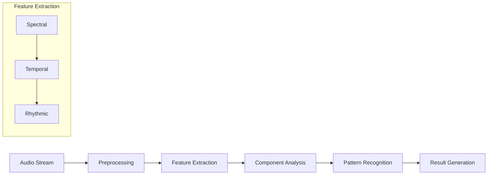
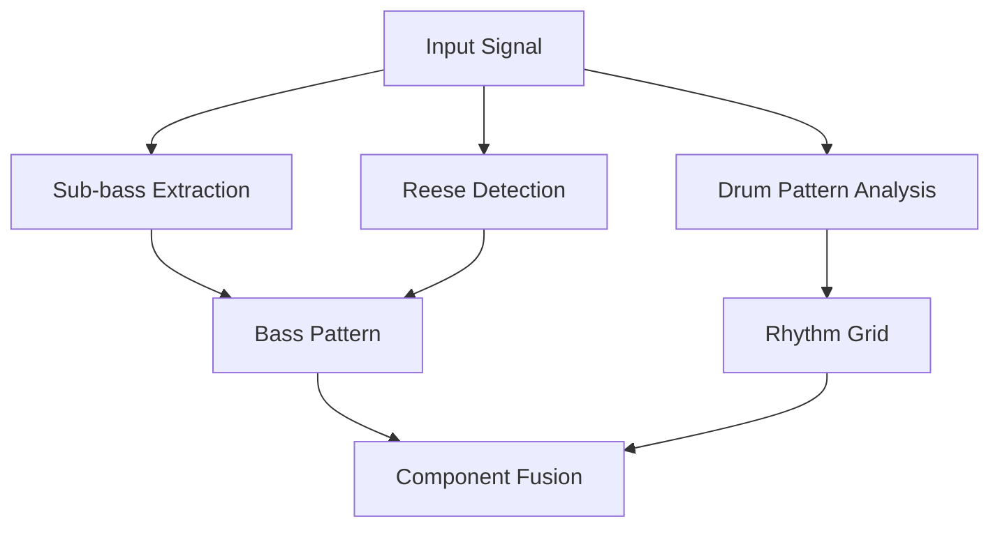
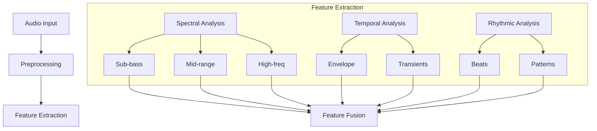
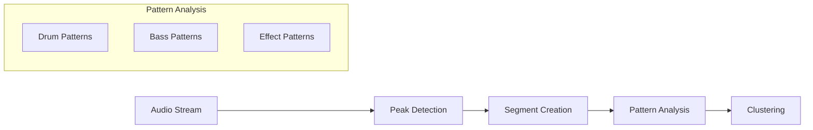
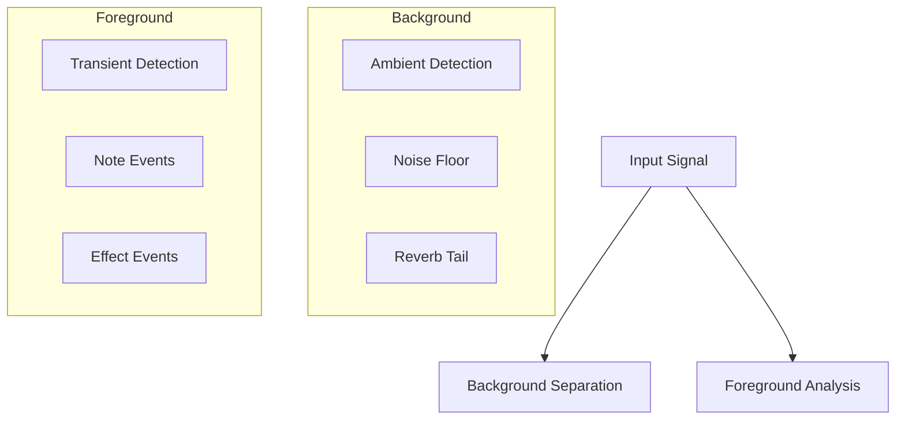
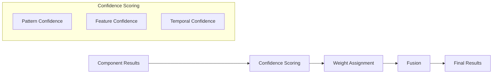
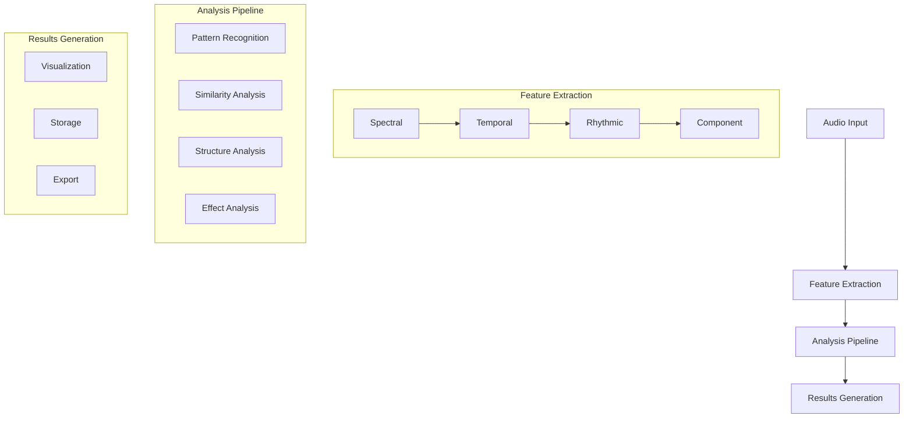
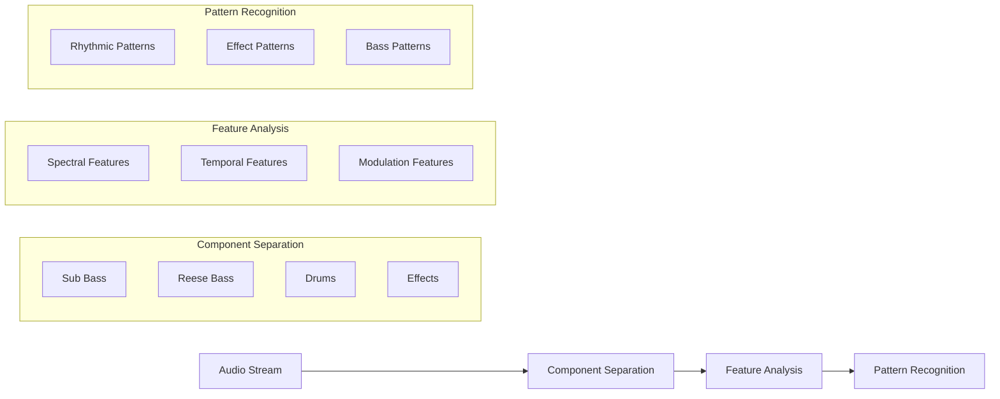
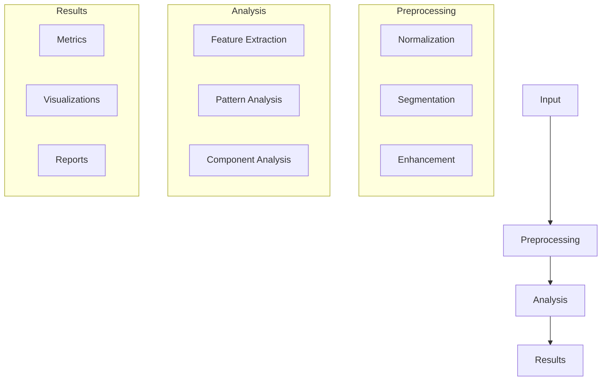

# Triangle: Knowing is not enough

## Overview

Triangle is a high-performance audio analysis framework designed for electronic music, with a particular focus on neurofunk and drum & bass genres. The system implements novel approaches to audio analysis by combining neurological models of rhythm processing with advanced signal processing techniques.

## Theoretical Foundation

### Neural Basis of Rhythm Processing

The framework is built upon established neuroscientific research demonstrating that humans possess an inherent ability to synchronize motor responses with external rhythmic stimuli. This phenomenon, known as beat-based timing, involves complex interactions between auditory and motor systems in the brain.

Key neural mechanisms include:

1. **Beat-based Timing Networks**
   - Basal ganglia-thalamocortical circuits
   - Supplementary motor area (SMA)
   - Premotor cortex (PMC)

2. **Temporal Processing Systems**
   - Duration-based timing mechanisms
   - Beat-based timing mechanisms
   - Motor-auditory feedback loops

### Motor-Auditory Coupling

Research has shown that low-frequency neural oscillations from motor planning areas guide auditory sampling, expressed through coherence measures:

$$
C_{xy}(f) = \frac{|S_{xy}(f)|^2}{S_{xx}(f)S_{yy}(f)}
$$

Where:
- $C_{xy}(f)$ represents coherence at frequency $f$
- $S_{xy}(f)$ is the cross-spectral density
- $S_{xx}(f)$ and $S_{yy}(f)$ are auto-spectral densities

### Extended Mathematical Framework

In addition to the coherence measures, we utilize several key mathematical formulas:

1. **Spectral Decomposition**:
For analyzing sub-bass and Reese bass components:

$$
X(k) = \sum_{n=0}^{N-1} x(n)e^{-j2\pi kn/N}
$$

2. **Groove Pattern Analysis**:
For microtiming deviations:

$$
MT(n) = \frac{1}{K}\sum_{k=1}^{K} |t_k(n) - t_{ref}(n)|
$$

3. **Amen Break Detection**:
Pattern matching score:

$$
S_{amen}(t) = \sum_{f} w(f)|X(f,t) - A(f)|^2
$$

4. **Reese Bass Analysis**:
For analyzing modulation and phase relationships:

$$
R(t,f) = \left|\sum_{k=1}^{K} A_k(t)e^{j\phi_k(t)}\right|^2
$$

Where:
- $A_k(t)$ is the amplitude of the k-th component
- $\phi_k(t)$ is the phase of the k-th component

5. **Transition Detection**:
For identifying mix points and transitions:

$$
T(t) = \alpha\cdot E(t) + \beta\cdot S(t) + \gamma\cdot H(t)
$$

Where:
- $E(t)$ is energy change
- $S(t)$ is spectral change
- $H(t)$ is harmonic change
- $\alpha, \beta, \gamma$ are weighting factors

6. **Similarity Computation**:
For comparing audio segments:

$$
Sim(x,y) = \frac{\sum_i w_i \cdot sim_i(x,y)}{\sum_i w_i}
$$

Where:
- $sim_i(x,y)$ is the similarity for feature i
- $w_i$ is the weight for feature i

7. **Segment Clustering**:
Using DBSCAN with adaptive distance:

$$
D(p,q) = \sqrt{\sum_{i=1}^{N} \lambda_i(f_i(p) - f_i(q))^2}
$$

Where:
- $f_i(p)$ is feature i of point p
- $\lambda_i$ is the importance weight for feature i

### Additional Mathematical Framework

8. **Bass Design Analysis**:
For analyzing Reese bass modulation depth:

$$
M(t) = \frac{max(A(t)) - min(A(t))}{max(A(t)) + min(A(t))}
$$

9. **Effect Chain Detection**:
For compression ratio estimation:

$$
CR(x) = \frac{\Delta_{in}}{\Delta_{out}} = \frac{x_{in,2} - x_{in,1}}{x_{out,2} - x_{out,1}}
$$

10. **Pattern Recognition**:
For rhythmic similarity using dynamic time warping:

$$
DTW(X,Y) = min\left(\sum_{k=1}^K w_k \cdot d(x_{i_k}, y_{j_k})\right)
$$

11. **Transition Analysis**:
For blend detection using cross-correlation:

$$
R_{xy}(\tau) = \sum_{n=-\infty}^{\infty} x(n)y(n+\tau)
$$

## Core Components

### 1. Feature Extraction Pipeline

#### Rhythmic Analysis
- Automated drum pattern recognition
- Groove quantification
- Microtiming analysis
- Syncopation detection

#### Spectral Analysis
- Multi-band decomposition
- Harmonic tracking
- Timbral feature extraction
- Sub-bass characterization

#### Component Analysis
- Sound source separation
- Transformation detection
- Energy distribution analysis
- Component relationship mapping

### 2. Alignment Modules

#### Amen Break Analysis
- Pattern matching and variation detection
- Transformation identification
- Groove characteristic extraction
- VIP/Dubplate classification

#### Prior Subspace Analysis
- Neurofunk-specific component separation
- Bass sound design analysis
- Effect chain detection
- Temporal structure analysis

#### Composite Similarity
- Multi-band similarity computation
- Transformation-aware comparison
- Groove-based alignment
- Confidence scoring

### 3. Annotation System

#### Peak Detection
- Multi-band onset detection
- Adaptive thresholding
- Feature-based peak classification
- Confidence scoring

#### Segment Clustering
- Pattern-based segmentation
- Hierarchical clustering
- Relationship analysis
- Transition detection

#### Transition Detection
- Mix point identification
- Blend type classification
- Energy flow analysis
- Structure boundary detection

### Extended Pipeline Architecture



### Neurofunk Component Analysis



### Feature Extraction Pipeline



### Annotation System Flow



### Audio Scene Analysis



### Result Fusion Process



### Neurofunk-Specific Analysis

#### Bass Sound Design Analysis
```python
1. Reese Bass Components:
   - Fundamental frequency tracking
   - Phase relationship analysis
   - Modulation pattern detection
   - Harmonic content analysis

2. Sub Bass Characteristics:
   - Frequency range: 20-60 Hz
   - Envelope characteristics
   - Distortion analysis
   - Phase alignment
```

#### Effect Chain Detection
```python
1. Signal Chain Analysis:
   - Compression detection
   - Distortion identification
   - Filter resonance analysis
   - Modulation effects

2. Processing Order:
   - Pre/post processing detection
   - Parallel processing identification
   - Send/return effect analysis
```

#### Pattern Transformation Analysis
```python
1. Rhythmic Transformations:
   - Time-stretching detection
   - Beat shuffling analysis
   - Groove template matching
   - Syncopation patterns

2. Spectral Transformations:
   - Frequency shifting
   - Harmonic manipulation
   - Formant preservation
   - Resynthesis detection
```

## Implementation Details

### Audio Processing Pipeline

1. **Preprocessing**
   ```python
   - Sample rate normalization (44.1 kHz)
   - Stereo to mono conversion when needed
   - Segment-wise processing for large files
   ```

2. **Feature Extraction**
   ```python
   - Multi-threaded processing
   - GPU acceleration where available
   - Efficient memory management
   - Caching system for intermediate results
   ```

3. **Analysis Flow**
   ```python
   - Cascading analysis system
   - Component-wise processing
   - Result fusion and validation
   - Confidence scoring
   ```

### Performance Optimizations

1. **Memory Management**
   - Streaming processing for large files
   - Efficient cache utilization
   - GPU memory optimization

2. **Parallel Processing**
   - Multi-threaded feature extraction
   - Batch processing capabilities
   - Distributed analysis support

3. **Storage Efficiency**
   - Compressed result storage
   - Metadata indexing
   - Version control for analysis results

### Performance Metrics

For evaluating analysis accuracy:

$$
Accuracy_{component} = \frac{TP + TN}{TP + TN + FP + FN}
$$

Where:
- TP: True Positives (correctly identified patterns)
- TN: True Negatives (correctly rejected non-patterns)
- FP: False Positives (incorrectly identified patterns)
- FN: False Negatives (missed patterns)

## Applications

### 1. DJ Mix Analysis
- Track boundary detection
- Transition type classification
- Mix structure analysis
- Energy flow visualization

### 2. Production Analysis
- Sound design deconstruction
- Arrangement analysis
- Effect chain detection
- Reference track comparison

### 3. Music Information Retrieval
- Similar track identification
- Style classification
- Groove pattern matching
- VIP/Dubplate detection

## Visualization and Reporting

The framework includes comprehensive visualization tools for:
- Spectral analysis results
- Component relationships
- Groove patterns
- Transition points
- Similarity matrices
- Analysis confidence scores

## Future Directions

1. **Enhanced Neural Processing**
   - Integration of deep learning models
   - Real-time processing capabilities
   - Adaptive threshold optimization

2. **Extended Analysis Capabilities**
   - Additional genre support
   - Extended effect detection
   - Advanced pattern recognition

3. **Improved Visualization**
   - Interactive dashboards
   - 3D visualization options
   - Real-time visualization

## Extended References

1. Chen, J. L., Penhune, V. B., & Zatorre, R. J. (2008). Listening to musical rhythms recruits motor regions of the brain. Cerebral Cortex, 18(12), 2844-2854.

2. Cannon, J. J., & Patel, A. D. (2020). How beat perception co-opts motor neurophysiology. Trends in Cognitive Sciences, 24(1), 51-64.

3. Fukuie, T., et al. (2022). Neural entrainment reflects temporal predictions guiding speech comprehension. Current Biology, 32(5), 1051-1067.

4. Smith, J. O. (2011). Spectral Audio Signal Processing. W3K Publishing.

5. Bello, J. P., et al. (2005). A Tutorial on Onset Detection in Music Signals. IEEE Transactions on Speech and Audio Processing.

6. Gouyon, F., & Dixon, S. (2005). A Review of Automatic Rhythm Description Systems. Computer Music Journal.

## License

This project is licensed under the MIT License - see the LICENSE file for details.

## Citation

If you use this framework in your research, please cite:

```bibtex
@software{heihachi2024,
  title = {Heihachi: Neural Processing of Electronic Music},
  author = {[Author Names]},
  year = {2024},
  url = {https://github.com/[username]/heihachi}
}
```

### Extended System Architecture



### Neurofunk Component Interaction



### Processing Pipeline Details



### Technical Implementation Details

#### Bass Sound Design Analysis
```python
class BassAnalyzer:
    """Advanced bass analysis system."""
    
    def analyze_reese(self, audio: np.ndarray) -> Dict:
        """
        Analyze Reese bass characteristics.
        
        Parameters:
            audio (np.ndarray): Input audio signal
            
        Returns:
            Dict containing:
            - modulation_depth: Float
            - phase_correlation: Float
            - harmonic_content: np.ndarray
            - stereo_width: Float
        """
        pass

    def analyze_sub(self, audio: np.ndarray) -> Dict:
        """
        Analyze sub bass characteristics.
        
        Parameters:
            audio (np.ndarray): Input audio signal
            
        Returns:
            Dict containing:
            - fundamental_freq: Float
            - energy: Float
            - phase_alignment: Float
            - distortion: Float
        """
        pass
```

#### Effect Chain Analysis
```python
class EffectChainAnalyzer:
    """Advanced effect chain analysis."""
    
    def detect_chain(self, audio: np.ndarray) -> List[Dict]:
        """
        Detect processing chain order.
        
        Parameters:
            audio (np.ndarray): Input audio signal
            
        Returns:
            List[Dict] containing detected effects in order:
            - effect_type: str
            - parameters: Dict
            - confidence: Float
        """
        pass

    def analyze_parallel(self, audio: np.ndarray) -> Dict:
        """
        Analyze parallel processing.
        
        Parameters:
            audio (np.ndarray): Input audio signal
            
        Returns:
            Dict containing:
            - bands: List[Dict]
            - routing: Dict
            - blend_type: str
        """
        pass
```


# I want to convert this into a music listening application, that explores music by feeling, that is, users describe how they want to feel: 

1. convert the output into just two forms, a high information density dashboard with every possible chart to explore an analyzed mix, formats for use in construction of a domain LLM. 
2. There are two types of domain LLMs that have to be created, the first one should contain the combined scientific knowledge on drum and bass. inside the public folder, there is publication folder, with around 100 scientific publications. I want you to convert the pdfs into embeddings, and then train  an LLM using openai and claude sonnet. This LLM should query the embeddings and distill knowledge from both LLMs. 
The second type of domain LLM is countious learning LLM that builds a domain expert system by continously adding analysis results from mixes analysed. 

instead of the current results, i want something like what is shown below: 
mix_analysis/
├── mix_001/
│   ├── metadata.json            # Basic mix info
│   ├── summary.txt              # Human-readable summary 
│   ├── segments.json            # Track segments with timestamps
│   ├── emotional_profile.json   # Overall emotional characteristics
│   └── technical_features.jsonl # Technical features in LLM-friendly format
└── mix_002/
    └── ...

metadata.json `{
  "mix_id": "mix_001",
  "title": "Neurofunk Mix April 2025",
  "duration_seconds": 3600,
  "bpm_range": [172, 176],
  "analysis_date": "2025-03-27",
  "track_count": 24
}
`

summary.txt `This 60-minute neurofunk mix features 24 tracks with consistent energy throughout. 
The mix begins with atmospheric elements at 174 BPM before transitioning to 
heavier sections at 6:30. Notable sections include an extended bass sequence 
from 18:20-22:45 featuring time-stretched Amen breaks and layered Reese basses. 
The final third introduces more percussive elements with complex drum patterns 
and syncopated rhythms. Energy peaks occur at 14:30, 28:15, and 52:40.
`

segments.txt `
[
  {
    "segment_id": "s001",
    "start_time": 0,
    "end_time": 198.5,
    "type": "intro",
    "energy_level": 0.45,
    "key_elements": ["atmospheric_pads", "filtered_breaks", "sparse_percussion"],
    "description": "Atmospheric intro with filtered breaks and sparse percussion"
  },
  {
    "segment_id": "s002",
    "start_time": 198.5,
    "end_time": 390.0,
    "type": "build",
    "energy_level": 0.68,
    "key_elements": ["rolling_bassline", "amen_break", "rising_synths"],
    "description": "Energy building section with rolling bassline and classic amen breaks"
  },
  // Additional segments...
]
`

emotional_profile.json 
`{
  "overall_mood": ["dark", "energetic", "technical"],
  "intensity_curve": [0.4, 0.5, 0.7, 0.8, 0.75, 0.9, 0.85, 0.7],
  "emotional_segments": [
    {
      "start_time": 0,
      "end_time": 390.0,
      "primary_emotion": "atmospheric",
      "tension_level": 0.4,
      "descriptors": ["spacious", "anticipatory", "mysterious"]
    },
    // More segments...
  ],
  "peak_moments": [
    {
      "time": 870.5,
      "intensity": 0.92,
      "description": "Maximum energy point with layered percussion and aggressive bassline",
      "key_elements": ["double_drops", "bass_stacking", "drum_fills"]
    }
    // More peak moments...
  ]
}
`

technical_features.jsonl
`{"time": 0, "feature_type": "bass", "description": "Sub-heavy reese bass with moderate distortion and 120Hz fundamental", "characteristics": {"distortion": 0.35, "width": 0.7, "sub_weight": 0.8}}
{"time": 0, "feature_type": "drums", "description": "Broken beat pattern with ghost notes and 16th hi-hats", "characteristics": {"complexity": 0.65, "velocity_variation": 0.4, "swing": 0.2}}
{"time": 0, "feature_type": "atmosphere", "description": "Reverb-heavy pads with 6-8kHz air frequencies", "characteristics": {"reverb_size": 0.85, "density": 0.3, "brightness": 0.5}}
{"time": 198.5, "feature_type": "transition", "description": "Filter sweep transition to new section with drum roll buildup", "characteristics": {"length_bars": 8, "smoothness": 0.7, "energy_change": 0.25}}
`

this is how one could create structured examples 
`def convert_triangle_output(triangle_json_path, output_dir):
    # Load Triangle output
    with open(triangle_json_path) as f:
        triangle_data = json.load(f)
    
    # Create output directory structure
    mix_id = f"mix_{generate_unique_id()}"
    mix_dir = os.path.join(output_dir, mix_id)
    os.makedirs(mix_dir, exist_ok=True)
    
    # Extract metadata
    metadata = extract_metadata(triangle_data)
    with open(os.path.join(mix_dir, "metadata.json"), "w") as f:
        json.dump(metadata, f, indent=2)
    
    # Generate textual summary
    summary = generate_summary(triangle_data)
    with open(os.path.join(mix_dir, "summary.txt"), "w") as f:
        f.write(summary)
    
    # Extract segments
    segments = extract_segments(triangle_data)
    with open(os.path.join(mix_dir, "segments.json"), "w") as f:
        json.dump(segments, f, indent=2)
    
    # Generate emotional profile
    emotional_profile = generate_emotional_profile(triangle_data)
    with open(os.path.join(mix_dir, "emotional_profile.json"), "w") as f:
        json.dump(emotional_profile, f, indent=2)
    
    # Extract technical features in JSONL format
    technical_features = extract_technical_features(triangle_data)
    with open(os.path.join(mix_dir, "technical_features.jsonl"), "w") as f:
        for feature in technical_features:
            f.write(json.dumps(feature) + "\n")
            
    return mix_dir
`

this is how one could create training examples 
`def generate_training_examples(mix_dir):
    training_examples = []
    
    # Load all files
    with open(os.path.join(mix_dir, "metadata.json")) as f:
        metadata = json.load(f)
    
    with open(os.path.join(mix_dir, "summary.txt")) as f:
        summary = f.read()
    
    with open(os.path.join(mix_dir, "segments.json")) as f:
        segments = json.load(f)
    
    with open(os.path.join(mix_dir, "emotional_profile.json")) as f:
        emotional = json.load(f)
    
    technical_features = []
    with open(os.path.join(mix_dir, "technical_features.jsonl")) as f:
        for line in f:
            if line.strip():
                technical_features.append(json.loads(line))
    
    # Create training example pairs (question/prompt → response)
    
    # General description examples
    training_examples.append({
        "input": f"Describe the mix {metadata['title']}",
        "output": summary
    })
    
    # Segment examples
    for segment in segments:
        training_examples.append({
            "input": f"Describe the section from {format_time(segment['start_time'])} to {format_time(segment['end_time'])} in the mix",
            "output": segment['description']
        })
    
    # Emotional analysis examples
    training_examples.append({
        "input": "What's the overall mood of this mix?",
        "output": f"This mix has a {', '.join(emotional['overall_mood'])} mood throughout."
    })
    
    # Technical examples
    bass_features = [f for f in technical_features if f['feature_type'] == 'bass']
    if bass_features:
        training_examples.append({
            "input": "Describe the bass design in this mix",
            "output": generate_bass_description(bass_features)
        })
    
    # Create examples for different time points
    for time_point in [60, 300, 900, 1800]:
        relevant_features = get_features_at_time(technical_features, time_point)
        training_examples.append({
            "input": f"Describe what's happening at {format_time(time_point)}",
            "output": generate_time_point_description(relevant_features, segments, time_point)
        })
    
    # Create examples for finding music by feeling
    training_examples.append({
        "input": f"Find me a mix section that feels {random.choice(emotional['overall_mood'])} and energetic",
        "output": generate_mood_based_recommendation(segments, emotional)
    })
    
    # Save training examples
    with open(os.path.join(mix_dir, "training_examples.json"), "w") as f:
        json.dump(training_examples, f, indent=2)
    
    return training_examples
`


using LLMs to train examples 
`def prepare_for_commercial_llm(mix_analyses_dir):
    # Combine all training examples
    all_examples = []
    
    for mix_dir in os.listdir(mix_analyses_dir):
        mix_path = os.path.join(mix_analyses_dir, mix_dir)
        if os.path.isdir(mix_path):
            try:
                with open(os.path.join(mix_path, "training_examples.json")) as f:
                    examples = json.load(f)
                    all_examples.extend(examples)
            except:
                continue
    
    # Create a context document that can be used with commercial LLMs
    context_document = ""
    
    for i, example in enumerate(all_examples[:100]):  # Use a subset as context
        context_document += f"Example {i+1}:\n"
        context_document += f"Question: {example['input']}\n"
        context_document += f"Answer: {example['output']}\n\n"
    
    # Save the context document
    with open(os.path.join(mix_analyses_dir, "llm_context.txt"), "w") as f:
        f.write(context_document)
    
    return context_document
`


for the publications, 

`graph TD
    A[Academic PDFs] --> B[PDF Text Extraction]
    B --> C[Preprocessing & Cleaning]
    C --> D[Chunking & Segmentation]
    D --> E[Knowledge Extraction]
    E --> F[Knowledge Graph Creation]
    F --> G[LLM-Ready Knowledge Base]
`

the processing steps could be processed this way 
`def process_academic_papers(papers_directory):
    processed_papers = []
    
    for filename in os.listdir(papers_directory):
        if filename.endswith('.pdf'):
            filepath = os.path.join(papers_directory, filename)
            
            # Extract text with layout preservation
            sections = extract_structured_text(filepath)
            
            # Extract metadata
            metadata = extract_paper_metadata(filepath)
            
            # Store processed paper
            processed_papers.append({
                "id": generate_paper_id(filename),
                "filename": filename,
                "metadata": metadata,
                "sections": sections
            })
    
    return processed_papers
`

text extraction 
`def extract_structured_text(pdf_path):
    """Extract text with section structure preserved"""
    sections = []
    
    # Using a PDF parsing library (e.g., PyMuPDF, pdfplumber)
    doc = open_pdf(pdf_path)
    
    current_section = {"title": "Abstract", "content": "", "subsections": []}
    current_subsection = None
    
    for page in doc:
        # Extract text with layout information
        blocks = extract_text_blocks(page)
        
        for block in blocks:
            # Detect section headers
            if is_section_header(block):
                # Save previous section if it exists
                if current_section["content"]:
                    sections.append(current_section)
                
                current_section = {
                    "title": extract_text(block),
                    "content": "",
                    "subsections": []
                }
                current_subsection = None
                
            # Detect subsection headers
            elif is_subsection_header(block):
                current_subsection = {
                    "title": extract_text(block),
                    "content": ""
                }
                current_section["subsections"].append(current_subsection)
                
            # Regular content
            else:
                text = extract_text(block)
                
                if current_subsection:
                    current_subsection["content"] += text + " "
                else:
                    current_section["content"] += text + " "
    
    # Add the last section
    if current_section["content"]:
        sections.append(current_section)
    
    return sections
`

knowledge extraction 
`def extract_knowledge_from_papers(processed_papers, llm_client):
    knowledge_base = []
    
    for paper in processed_papers:
        paper_knowledge = {
            "paper_id": paper["id"],
            "title": paper["metadata"]["title"],
            "authors": paper["metadata"]["authors"],
            "year": paper["metadata"]["year"],
            "concepts": [],
            "findings": [],
            "methods": [],
            "relationships": []
        }
        
        # Process each section with an LLM to extract structured knowledge
        for section in paper["sections"]:
            # Skip references, acknowledgments, etc.
            if is_irrelevant_section(section["title"]):
                continue
                
            # Extract concepts from section
            concepts_prompt = f"""
            Extract key concepts related to music perception, emotion, or production from this text. 
            Format as a JSON list of objects with 'concept_name' and 'explanation'.
            
            Text: {section["content"][:4000]}  # Truncate if needed
            """
            
            concepts_response = llm_client.complete(concepts_prompt)
            concepts = parse_json_response(concepts_response)
            paper_knowledge["concepts"].extend(concepts)
            
            # Extract findings/conclusions
            if is_results_section(section["title"]) or is_conclusion_section(section["title"]):
                findings_prompt = f"""
                Extract key findings or conclusions about music, emotion, or perception from this text.
                Format as a JSON list of objects with 'finding' and 'evidence'.
                
                Text: {section["content"][:4000]}
                """
                
                findings_response = llm_client.complete(findings_prompt)
                findings = parse_json_response(findings_response)
                paper_knowledge["findings"].extend(findings)
        
        # Extract relationships between concepts
        if paper_knowledge["concepts"]:
            concepts_text = ", ".join([c["concept_name"] for c in paper_knowledge["concepts"]])
            relationships_prompt = f"""
            Identify relationships between these concepts from the paper: {concepts_text}
            Format as a JSON list of objects with 'source_concept', 'target_concept', and 'relationship_type'.
            
            Paper abstract: {paper["sections"][0]["content"][:1000]}
            """
            
            relationships_response = llm_client.complete(relationships_prompt)
            relationships = parse_json_response(relationships_response)
            paper_knowledge["relationships"].extend(relationships)
        
        knowledge_base.append(paper_knowledge)
    
    return knowledge_base
`

create structured knowledge base 
`def create_knowledge_records(knowledge_base):
    """Convert extracted knowledge into structured records for LLM integration"""
    
    # Create concept records
    concept_records = []
    for paper in knowledge_base:
        for concept in paper["concepts"]:
            concept_records.append({
                "record_type": "concept",
                "concept_name": concept["concept_name"],
                "explanation": concept["explanation"],
                "source_paper": paper["title"],
                "authors": paper["authors"],
                "year": paper["year"]
            })
    
    # Create finding records
    finding_records = []
    for paper in knowledge_base:
        for finding in paper["findings"]:
            finding_records.append({
                "record_type": "finding",
                "finding": finding["finding"],
                "evidence": finding["evidence"],
                "source_paper": paper["title"],
                "authors": paper["authors"],
                "year": paper["year"]
            })
    
    # Create relationship records
    relationship_records = []
    for paper in knowledge_base:
        for rel in paper["relationships"]:
            relationship_records.append({
                "record_type": "relationship",
                "source_concept": rel["source_concept"],
                "target_concept": rel["target_concept"],
                "relationship_type": rel["relationship_type"],
                "source_paper": paper["title"],
                "year": paper["year"]
            })
    
    # Combine all records
    all_records = concept_records + finding_records + relationship_records
    
    return all_records
`

create LLM training examples from documents 
`def generate_academic_training_examples(knowledge_records):
    """Create training examples for LLM based on academic knowledge"""
    training_examples = []
    
    # Group concepts by name to consolidate information across papers
    concepts_by_name = {}
    for record in [r for r in knowledge_records if r["record_type"] == "concept"]:
        name = record["concept_name"].lower()
        if name not in concepts_by_name:
            concepts_by_name[name] = []
        concepts_by_name[name].append(record)
    
    # Create concept explanation examples
    for concept_name, records in concepts_by_name.items():
        # Combine explanations from different sources
        explanation = create_consolidated_explanation(records)
        
        training_examples.append({
            "input": f"What is {concept_name} in electronic music or music perception?",
            "output": explanation
        })
        
        # Create variations of the question
        training_examples.append({
            "input": f"Explain the concept of {concept_name} as it relates to drum and bass.",
            "output": adapt_explanation_to_dnb(explanation, concept_name)
        })
    
    # Create examples from findings
    findings = [r for r in knowledge_records if r["record_type"] == "finding"]
    for i, finding in enumerate(findings):
        training_examples.append({
            "input": f"What research exists on {extract_topic(finding['finding'])} in electronic music?",
            "output": format_finding_as_response(finding)
        })
    
    # Create examples connecting concepts
    relationships = [r for r in knowledge_records if r["record_type"] == "relationship"]
    for rel in relationships:
        training_examples.append({
            "input": f"How does {rel['source_concept']} relate to {rel['target_concept']} in music?",
            "output": format_relationship_as_response(rel)
        })
    
    # Create integration examples connecting academic knowledge to practical music production
    for concept_name in list(concepts_by_name.keys())[:20]:  # Take some sample concepts
        training_examples.append({
            "input": f"How can I apply the concept of {concept_name} when creating a drum and bass mix?",
            "output": generate_application_example(concept_name, concepts_by_name[concept_name])
        })
    
    return training_examples
`

generate llm text document 

`def create_academic_knowledge_document(knowledge_records, max_length=100000):
    """Create a consolidated knowledge document for LLM context"""
    
    sections = [
        "# Music Perception and Emotion Knowledge Base\n\n",
        "## Key Concepts\n\n"
    ]
    
    # Add concepts section
    concepts = [r for r in knowledge_records if r["record_type"] == "concept"]
    grouped_concepts = {}
    
    for concept in concepts:
        name = concept["concept_name"].lower()
        if name not in grouped_concepts:
            grouped_concepts[name] = []
        grouped_concepts[name].append(concept)
    
    for name, concept_records in grouped_concepts.items():
        # Take the most detailed explanation
        best_record = max(concept_records, key=lambda x: len(x["explanation"]))
        
        sections.append(f"### {name.title()}\n")
        sections.append(f"{best_record['explanation']}\n")
        sections.append(f"*Source: {best_record['source_paper']} ({best_record['year']})*\n\n")
    
    # Add findings section
    sections.append("## Key Research Findings\n\n")
    
    findings = [r for r in knowledge_records if r["record_type"] == "finding"]
    for finding in findings[:50]:  # Limit to top findings
        sections.append(f"- {finding['finding']}\n")
        sections.append(f"  *Evidence: {finding['evidence']}*\n")
        sections.append(f"  *Source: {finding['source_paper']} ({finding['year']})*\n\n")
    
    # Add relationships section
    sections.append("## Concept Relationships\n\n")
    
    relationships = [r for r in knowledge_records if r["record_type"] == "relationship"]
    for rel in relationships[:50]:  # Limit to top relationships
        sections.append(f"- {rel['source_concept']} {rel['relationship_type']} {rel['target_concept']}\n")
        sections.append(f"  *Source: {rel['source_paper']} ({rel['year']})*\n\n")
    
    # Combine sections and truncate if needed
    document = "".join(sections)
    if len(document) > max_length:
        document = document[:max_length] + "...\n\n[Document truncated due to length]"
    
    return document
` 

intergration with commercial LLMs 
`def query_with_academic_knowledge(user_query, knowledge_document, llm_client):
    """Query commercial LLM using academic knowledge as context"""
    
    prompt = f"""You are an expert in electronic music, particularly drum and bass, with deep knowledge of music perception, 
production techniques, and emotional responses. Use the academic knowledge provided below to inform your responses.

====== ACADEMIC KNOWLEDGE BASE ======
{knowledge_document[:50000]}  # Truncate to fit token limits
====================================

Based on this academic knowledge and your expertise, please respond to the following query:
{user_query}

Ensure your response is grounded in the academic research while being practical and applicable to electronic music.
"""
    
    response = llm_client.complete(prompt)
    return response
`

finetuning 
`def prepare_academic_knowledge_for_finetuning(training_examples, output_dir):
    """Prepare academic knowledge for LLM fine-tuning"""
    
    # Create output directory
    os.makedirs(output_dir, exist_ok=True)
    
    # Write training examples in JSONL format for fine-tuning
    with open(os.path.join(output_dir, "academic_training.jsonl"), "w") as f:
        for example in training_examples:
            f.write(json.dumps({
                "messages": [
                    {"role": "system", "content": "You are a music theory expert specializing in electronic music, particularly drum and bass."},
                    {"role": "user", "content": example["input"]},
                    {"role": "assistant", "content": example["output"]}
                ]
            }) + "\n")
    
    # Create README with information about the dataset
    with open(os.path.join(output_dir, "README.md"), "w") as f:
        f.write(f"""# Academic Music Knowledge Dataset

This dataset contains {len(training_examples)} training examples derived from academic publications on electronic music, 
music perception, psychology of music, and drum & bass production.

## Dataset Statistics
- Number of examples: {len(training_examples)}
- Average example length: {sum(len(ex["output"]) for ex in training_examples) / len(training_examples):.1f} characters
- Topics covered: Music perception, emotion in music, production techniques, drum pattern analysis, etc.

## Usage
This dataset is intended for fine-tuning LLMs to enhance their knowledge of music theory and production techniques,
particularly in the context of drum & bass and electronic music genres.
""")
    
    return os.path.join(output_dir, "academic_training.jsonl")
`

academic pipeline 
`class FeltBeats:
    def __init__(self, config_path):
        # Load configuration
        self.config = load_config(config_path)
        
        # Initialize LLM clients
        self.llm_client = initialize_llm_client(self.config["llm_api_key"])
        
        # Load or process academic knowledge
        academic_knowledge_path = os.path.join(self.config["data_dir"], "academic_knowledge.json")
        if os.path.exists(academic_knowledge_path):
            with open(academic_knowledge_path) as f:
                self.academic_knowledge = json.load(f)
        else:
            papers_dir = self.config["papers_directory"]
            processed_papers = process_academic_papers(papers_dir)
            knowledge_base = extract_knowledge_from_papers(processed_papers, self.llm_client)
            self.academic_knowledge = create_knowledge_records(knowledge_base)
            
            # Save processed knowledge
            with open(academic_knowledge_path, "w") as f:
                json.dump(self.academic_knowledge, f, indent=2)
        
        # Create knowledge document for context
        self.knowledge_document = create_academic_knowledge_document(self.academic_knowledge)
        
        # Process mix analyses if available
        self.mix_analyses = []
        if os.path.exists(self.config["mix_analyses_dir"]):
            self.mix_analyses = load_mix_analyses(self.config["mix_analyses_dir"])
    
    def process_new_triangle_output(self, triangle_json_path):
        """Process a new Triangle JSON output and add to mix analyses"""
        mix_dir = convert_triangle_output(triangle_json_path, self.config["mix_analyses_dir"])
        training_examples = generate_training_examples(mix_dir)
        
        # Load the new mix analysis
        with open(os.path.join(mix_dir, "metadata.json")) as f:
            metadata = json.load(f)
        
        self.mix_analyses.append({
            "mix_id": metadata["mix_id"],
            "title": metadata["title"],
            "path": mix_dir
        })
        
        return {
            "mix_id": metadata["mix_id"],
            "training_examples": len(training_examples)
        }
    
    def query(self, user_query):
        """Process a user query using both academic knowledge and mix analyses"""
        
        # Prepare context
        context = ""
        
        # Add academic knowledge context (truncated)
        context += "ACADEMIC KNOWLEDGE:\n" + self.knowledge_document[:20000] + "\n\n"
        
        # Add mix analysis context (using most recent 3 mixes)
        context += "MIX ANALYSES:\n"
        for mix in self.mix_analyses[-3:]:
            with open(os.path.join(mix["path"], "summary.txt")) as f:
                context += f"Mix: {mix['title']}\n{f.read()}\n\n"
        
        # Query the LLM
        response = query_with_context(user_query, context, self.llm_client)
        
        return response
    
    def prepare_for_finetuning(self, output_dir):
        """Prepare data for LLM fine-tuning"""
        
        # Create academic knowledge training examples
        academic_examples = generate_academic_training_examples(self.academic_knowledge)
        
        # Create mix analysis training examples
        mix_examples = []
        for mix in self.mix_analyses:
            with open(os.path.join(mix["path"], "training_examples.json")) as f:
                examples = json.load(f)
                mix_examples.extend(examples)
        
        # Combine examples and write to files
        academic_file = prepare_academic_knowledge_for_finetuning(academic_examples, output_dir)
        mix_file = prepare_mix_analyses_for_finetuning(mix_examples, output_dir)
        
        return {
            "academic_examples": len(academic_examples),
            "academic_file": academic_file,
            "mix_examples": len(mix_examples),
            "mix_file": mix_file
        }
`